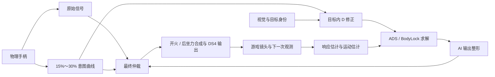

# 手柄连续意图改造：运行细节、测试成本与后续优化方案

日期：2026-09-26。本文面向需要判断改动是否有效、下一步该改哪里的人。

本次已在源码中把 25% 的人工意图硬门槛改为 15%～30% 的连续权重，并完成仲裁代码与测试执行器的小范围重构。局部交接连续性、原生零死区和现有产品测试通过；完整闭环仍有受保护指标退化，因此这份代码是待继续优化的候选，尚未替换实战启动程序。本文分别说明已实现的行为、实测结果和下一阶段设计，不把测试提速等同于瞄准改善。

## 1. 当前控制链路怎样运行

物理手柄输入有两种用途。原始输入负责无目标、退出瞄准等状态下的直接透传，微小偏移也应保留。人工意图用于决定玩家是否在修改当前目标内的瞄准位置，以及最终输出应给予玩家多少权重。后者可以衰减，前者保持零软件死区。

运行时以约 1 kHz 为目标控制节拍，同步处理手柄采样、目标权限、AI 求解、输出整形、仲裁、开火和后坐力；本次模拟采用固定 1 kHz，并未重新测量实战频率。视觉结果按自己的节拍到达，控制器会在同一个控制 tick 消费新结果；没有新结果时沿用仍有效的目标状态。ADS 负责一次按下瞄准后的快速定位，BodyLock 负责随后持续跟踪。下文的 D 指人体允许区域内的期望瞄准点，它可由玩家修正，不等于检测框中心。



旧实现把“输入超过 25%”同时当作意图接纳条件和最终输出权限开关。今天的日志中，人工输入只变化约 0.008，AI 提案也只变化约 0.008，最终轴值却跳变约 0.832。这发生在 AI 输出整形之后，所以仅调整 AI 加减速曲线无法消除这个交接突跳。原始日志定位、反事实与上一轮 17 组实验见[链路扫描结果](CONTROLLER_OSCILLATION_RESULTS_20260926.md)。

## 2. 已实现的 15%～30% 曲线

对每一根右摇杆轴独立计算输入幅度 `a = abs(raw)`，采用端点斜率为零的三次平滑曲线：

```text
t = clamp((a - 0.15) / 0.15, 0, 1)
人工意图权重 w = t² × (3 - 2t)
D 修正输入 = raw × w
```

| 单轴输入幅度 | 人工意图权重 |
|---:|---:|
| ≤15% | 0% |
| 20% | 25.93% |
| 22.5% | 50% |
| 25% | 74.07% |
| ≥30% | 100% |

这条曲线是随当前输入幅度变化的空间权重，不增加时间滤波、等待时间或回中滞后。X、Y 分别计算，避免横向大动作顺便放大纵向细小输入。原始信号不减中心偏置、不做防抖、不重映射剩余行程，DS4 自身的字节量化仍保留。

最终仲裁使用同一个 `w` 在 AI 提案与已有约束下的人工提案之间连续过渡。它读取原始人工提案，避免把已经乘过 `w` 的 D 修正信号再乘一次。原先“已经进入 D 修正就强制获得完整人工权重”的分支已移除，25% 不再拥有特殊的开关意义。

这里的 100% 是人工意图权重达到完整值，最终轴值仍受原有目标权限、同向协作、反向约束和模式规则影响。ADS 正常定位阶段仍由目标求解主导；允许人工介入的 ADS 安全阶段及开火下拉路径使用连续权重。明确退出和无目标直接透传原始手柄，不能让这条曲线拖住玩家操作。

实现分别位于 [intent_filter.cpp](../../native/controller_native/intent_filter.cpp)、[assist_control_state_machine.cpp](../../native/controller_native/assist_control_state_machine.cpp) 和 [native_gamepad_controller.cpp](../../native/controller_native/native_gamepad_controller.cpp)。原来放在公共头文件里的约 250 行仲裁实现已移到 `.cpp`；以后调整该实现时，无需让每个包含头文件的测试文件重新编译。

## 3. 本次验证到什么程度

新增曲线测试首先在原实现上失败，再验证新实现。连续性测试覆盖双轴、正反方向、新鲜/非新鲜观测、已有修正/带入手势和开火状态，共 64,032 个采样点，并逐点检查明确退出时原始透传。输入以 0.0005 的步长往返经过 15%、旧 25% 和 30%；最大最终输出变化为 0.004458，小于冻结的 0.02 上限。原生 DS4 近中心字节透传测试也通过。

72 组旧 25% 邻域检查的最大输出变化从 1.146438 降到 0.000219。该数值衡量的是局部交接连续性，不代表真实游戏全部过冲的下降幅度。按用户新规则，测试里的 D 接纳状态也改为由衰减后的意图产生；原来“25% 以下必须无意图”的断言已被新政策取代。完整人工权限测试移到 30%，并调整测试专用力预算以继续保证原有 0.05 的 AI 余量，未放宽权限和连续性判据。

现有 10 个 Base/Feature 套件全部通过，另重新构建并通过 4 个受共享代码影响的鼠标测试。已完成 324 个随机短长案例和同条件的 Sustained 矩阵：16 个参数包、64 条序列、864 个固定目标机会。矩阵保持原配置、种子、1575 ms 靶位和 50 ms 间隔，仍调用原非回归比较规则。

| 完整矩阵指标 | 原始基线 | 15%～30% 候选 |
|---|---:|---:|
| 获取目标 | 748 / 864 | 747 / 864 |
| 跟踪积分 | 303,216 | 283,753 |
| 振荡事件合计 | 260 | 230 |
| 振荡活跃时间 | 78,710 ms | 72,879 ms |
| 违反保护指标的参数包 | — | 12 / 16 |

表格用于解释取舍，不能以总数改善抵消单场景退化。16 条纯 AI 序列的所有 run 字段与基线完全一致，退化集中在有人手参与的序列。例如 `mixed_standard / seed 1337 / ADS` 的获取从 5 降到 4；其他场景也有穿越后继续推动、离开目标圈和跟踪积分退化，不能只把它归为浮点误差。

15%～25% 的人工输入此前被忽略，现在会逐渐参与 D 修正和仲裁，这是一项实际行为变化。当前证据证明曲线消除了旧局部硬切换，也证明整套控制逻辑尚未充分适应新的人手权重。因此，当前总体判定仍是 **FAILED CONSTRAINTS**，不能称为“不损失索敌的过冲优化”。没有继续消耗新的独立验证种子，也没有替换实战运行文件。

静止目标的响应/延迟失配回归仍然失败：四个方向在 10 秒内反复穿越中心 83～118 次。这组输入始终低于新曲线起点，说明后续仍需修正运动估计与控制反馈的关系。

## 4. 测试为什么让人等得久

上一轮没有完整的端到端计时，无法准确拆出全部等待时间。本轮补测表明，模拟程序本身并不需要很长时间；总等待还包括多轮源码修改、编译、结果分析和报告整理。上一轮连续尝试 17 组候选，也放大了每轮固定开销。

下表是本机实测，不是预计值。短任务采用三次测量的中位数；比较阶段还按相同输入交替运行旧、新执行方式，降低缓存和运行顺序的影响。

| 工作 | 耗时 | 范围与说明 |
|---|---:|---|
| 324 个随机闭环案例 | 1.39 s | 不输出逐 tick CSV，运行真实控制器与 DS4 编码 |
| 完整 Sustained 模拟矩阵 | 0.67 s | 16 个参数包并发执行，合计 864 个机会 |
| 旧比较方式 | 2.33 s | 16 个 PowerShell 进程，最多同时 4 个 |
| 新比较方式 | 0.75 s | 单个 PowerShell 进程依次调用同一检查脚本 |
| 10 个现有产品测试套件 | 1.16 s | 一次完整 CTest 实测 |
| 首轮公共接口变更后的构建 | 40.24 s | 涉及公共头文件、多个测试与四个目标，单次实测 |
| 后续实现/测试文件增量构建 | 8.82 s | 一处仲裁实现和一处测试修改，构建同四个目标，单次实测 |

比较阶段的时间减少约 **68%**。新执行器仍调用 `compare_sustained_aimlab.ps1`，没有复制或放宽判定逻辑；已对 16 个通过包和 16 个包含失败的包验证，退出结果及每条保护指标退化明细完全一致。执行失败、输入身份和报告哈希验证也仍然保留。

40.24 秒与 8.82 秒的修改范围不同，不能把二者当成严格的编译性能 A/B。它们说明了把常改实现移出公共头文件的实际用途。此次重构面向开发迭代成本，尚未测量它对实战 CPU 占用或控制延迟的影响，不据此宣称游戏运行更快。

测试输出也应按需要采集。上一轮仅一份 324 案例全量 CSV 就有约 92 MB。正常筛选只写案例指标；需要分析原因时，再对失败 seed/case 输出细节，能减少文件写入和读报告的负担。

## 5. 后续优化方案：统一运动模型，再验证新权重

下一轮应保留已经明确的 15%～30% 人工意图规则，集中修改闭环的模型关系。现有运动 observer 根据屏幕位置变化，加回估算的镜头运动，得到维持跟踪所需的运动量。响应强度或延迟估错时，自身镜头运动没有被准确抵消，其残差会再次进入持续跟踪补偿。

静止目标反事实给出了设计方向：只匹配模拟延迟，或只匹配模拟响应先验，都能使已知失配案例停止反复穿越中心。这说明模型失配足以激发振荡；实际游戏的 AA、镜头响应和目标运动仍未被独立测量，不能把反事实数值直接写成新的游戏默认参数。

建议分三步重构，每一步独立保留对照和可回退结果。

对于本次出现获取损失的混合输入序列，还应先对齐人工权重、手势用途、D 的移动和 ADS 结束时刻，判断损失来自新规则允许的人工改点，还是错误的提前交接或重复加权。意图幅度、手势用途和目标权限应各有明确职责；权重变小不应重新定义目标身份，权重进入过渡区也不应自动消费另一枚 ADS token。当前尚未证明这些退化都由响应模型造成，不能跳过这项定位直接套用模型改造。

**第一步，统一运动量的单位与时间窗口。** 让一个模块负责把已提交输出历史对齐到两次视觉采样之间的时间区间，明确区分原始手柄、响应曲线后的等效指令、后坐力贡献和 DS4 已量化输出。运动 observer 的历史状态统一保存为 px/s，避免响应模型变化时用新比例重新解释旧的归一化历史。此前独立单位测试已经证明这类坐标混用存在，但直接重标定的候选未通过全链路，因此这一步仍需与实际消费者一起验证。

**第二步，让响应强度与作用延迟进入同一个辨识模型。** 使用同目标、时间对齐的观测与输出变化，联合评估响应和有效延迟，并保留估计误差；减少把尚未被镜头体现的指令误算成目标运动。开火、目标加速和强辅瞄都会使两者难以区分，模型必须表达这种不确定性，不能仅因样本数量足够就提高信任。建议用连续置信权重调整运动观测的更新程度，复用现有有界输出历史，避免为每一种抖动形态添加专用开关。

**第三步，在同一个 BodyLock 求解中协调持续运动与位置修正。** 运动补偿负责维持已确认的目标运动，位置反馈负责消除当前误差；模型不确定时，应限制未经证实的额外补偿对下一时刻的影响，同时保留对真实移动目标的持续跟踪需求。这里需要验证的是跟踪速度、停止后的收敛和换向响应共同改善，不能通过统一降低力度、延长等待或停用 observer 来获得漂亮的摆动数字。新人工权重必须纳入这一步的混合输入验证。

参数辨识可随新鲜视觉样本更新，权限、目标生命周期、人工仲裁及最终输出仍在完整控制节拍上同步执行。这个方案不恢复独立低频 AI proposal，也不缓存过期的控制权。

为了缩短每轮反馈，执行顺序应固定为：先跑局部意图/单位不变量和双轴失配回归；通过后跑相关产品测试；再跑已有随机开发集和完整矩阵；只有无保护指标退化的候选才使用冻结的独立种子，最后做匹配的 native/live A/B 与手感确认。已知失败应在最早一层结束，不再继续做无意义的全面验证。基线按源码、构建产物、配置、fixture、种子和环境身份复用，不能仅凭文件名认作同一版本。

此方案的预期收益是减少自身镜头运动形成的错误持续补偿，并降低开发迭代开销。实际过冲、获取和跟踪收益仍要由固定案例及实战对照证明，当前没有给出未经验证的改善比例。

## 复现与证据入口

- 曲线和整链结果：`runs/intent_curve_20260926/curve_continuity.json`、`curve_scan.json`、`curve_summary.json`、`curve_matrix/comparison.json`。
- 模型失配仍为 RED：`runs/intent_curve_20260926/stationary_still_red.json`。
- 计时与检查等价性：`baseline_performance.json`、`matched_comparison_performance.json`、`batch_parity.json`、`curve_build.json`、`incremental_build.json`，均位于上述目录。
- 批量执行工具：[run_oscillation_matrix.py](../../scripts/verify/run_oscillation_matrix.py)、[compare_oscillation_matrix.py](../../scripts/verify/compare_oscillation_matrix.py)；复用检查脚本的宿主为同目录的 `compare_oscillation_matrix.ps1`。
- 默认边界已同步到根 `AGENTS.md`；项目交接记录仍建议引用本文及上一轮结果，避免把旧 25% 门槛或已失败的参数调整当作当前方案。

原始日志、配置和实战启动程序未被本次测试替换。运行记录在本地忽略目录中，正式代码变更与候选是否达到发布标准需分别审阅。
