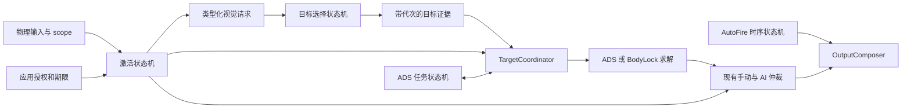

# Vision → Controller 状态机重构与验收

日期：2026-09-28。状态：实现完成，自动化验收通过。比较基线：`2fd12d292d91a547c37113f6ca7b06e49184a111`。构建与证据位于 `runs/state_machine_refactor_20260928/`，未替换日常运行目录的二进制。

## 为什么要拆分“正在瞄准”

应用需要在玩家没有开镜、没有开火时也能主动提供瞄准辅助。原有布尔接口同时承担物理动作、视觉工作请求和 AI 输出许可的部分含义。只放宽其中一个判断，会出现视觉不搜索、controller 提前退出，或轻量辅助误用 ADS 任务的情况。

本次把这三个问题分开：物理输入描述玩家做了什么，激活状态说明当前辅助由谁授权，目标证据决定是否存在可用提案。跨 tick 的任务、身份和按钮时序由各自的状态机持有。误差、置信度、速度及控制曲线仍按原有数值算法计算。

`is_aiming` 接口、成员、参数及其调用方已经删除，没有保留旧别名。Python controller 使用 `aim_activation()` 返回类型化来源；native 使用 `AssistActivation`。真正需要物理 ADS 的压枪模式与 AutoFire 消费物理状态，不从“允许搜索”推导开镜。

## 四个状态机如何接入生产链

控制链保持同 tick 同步执行，没有新增事件总线、后台控制阶段或可切换的新旧实现。视觉仍通过最新快照交付；请求种类和请求代次共同限制快照的使用。



| 模块及实现 | 持有的状态 | 对下游的约束 |
|---|---|---|
| `AssistActivationReducer` | 应用授权 Inactive/Granted、截止时间，以及有效 Off/Primed/Engaged/Application 状态 | 搜索、辅助输出和 ADS 任务许可分别投影；应用授权不会合成 LT 边沿 |
| `AdsLifecycleReducer` | 等待、获取、扩展、手动安全、完成和消耗状态；token、任务时钟、同人证据等待 | coordinator 提交证据，reducer 决定转换；低层阶段修改接口已私有化 |
| `SelectionStateMachine` | Empty/Observed/Missing/CueOnly；Idle/Confirming；active、pending、generation、漏检和确认计数 | 目标确认与身份提交统一执行；短缺帧不等于新身份 |
| `ManualFireStateMachine` 与 `FirePulseStateMachine` | Free/Held/ResumeGuard，以及 Idle/Pressed/Gap | 手动接管、恢复保护和合成按钮脉冲有独立时序归属；取消资格立即复位脉冲 |

最终手动/AI 权限仍由 `AssistControlStateMachine` 一处决定。它的入口改为消费激活契约，原有 Capture、Track、HandoverSeek 等仲裁状态继续使用。删除了 coordinator 的 `ads_reacquire_waiting_` 和独立 `AimModeReducer`，没有再保存一份 ADS 阶段副本。

实现入口分别是 [激活 reducer](../../native/controller_native/assist_activation_reducer.h)、[ADS reducer](../../native/controller_native/ads_lifecycle_reducer.h)、[选择状态机](../../native/vision_native/include/vision_native/selection_state_machine.h)、[开火状态机](../../native/controller_native/auto_fire_state_machine.h)。[architecture.json](../../native/control_contract/architecture.json) 已升级到版本 6，记录当前归属和数据流。

## AI aim 怎样激活和退出

有效激活状态按当前事实计算。物理 ADS 达到 ready 或配置允许的手动开火进入 Engaged；只有轻按 scope 时进入 Primed；没有物理 scope 且应用授权有效时进入 Application；其余情况为 Off。物理 scope 优先，应用期限照常流逝，离开物理 scope 后只恢复尚未到期的授权。

| 状态 | 视觉请求 | 允许 AI 提案 | 可以拥有 ADS 任务 |
|---|---|---|---|
| Off | 无标记时 Idle，有标记时 DetectionOnly | 否 | 否 |
| Primed | AssistSearch | 否 | 否 |
| Engaged | AssistSearch | 是，沿用既有策略 | 是，仍须真实输入事件触发 |
| Application | AssistSearch | 是，使用应用预算 | 否 |

应用在 controller 所属线程调用 `request_assist_until(deadline, max_ai_magnitude)`，期限使用 controller 的单调时钟；`revoke_application_assist()` 显式撤销。例如在当前时刻加 5 秒即为一次限时授权。到期、撤销、reset 或断连终止授权，重连不恢复旧授权。API 不负责绑定具体按键。

应用模式使用现有 BodyLock 求解和最终仲裁。`max_ai_magnitude` 默认 0.10，限制整形后的 AI 摇杆向量长度；限幅发生在最终手动/AI 仲裁之前，不限制玩家原始输入，也不把压枪计入这份预算。当前目标有效性、敌我过滤、拾取范围、手动退出规则继续生效。因此这次交付的是独立应用授权及完整输出通路，尚未扩大为整个画面任意位置都可拾取的产品行为。

视觉契约为 Idle、DetectionOnly、AssistSearch。DetectionOnly 可以返回供标记使用的检测结果，但不发布 aim/fire authority。即使 DetectionOnly 和 AssistSearch 都需要检测，它们之间的转换也推进请求代次；在途旧结果不得跨代次取得权限。授权退出后，最终仲裁同 tick 回到手动物理输入。

应用授权本身不会赋予物理 ADS 开火资格。AutoFire 继续检查自己的配置、目标证据和 readiness；已有配置允许的非 ADS 自动开火策略保持独立。Python 视觉端的 ADS 开火事件已改为 `on_physical_ads()`，Application 和 ManualFire 搜索状态不能冒充物理 ADS。

## ADS、目标身份与 AutoFire 的转换边界

ADS 的 `begin_tick()` 处理 scope 退出和初次目标等待期限，`select()` 接收当前选择证据，`missing()` 决定保留、等待或释放，`advance()` 推进执行阶段。几何是否稳定、是否越过中心仍由 coordinator 根据观测计算，再作为事实交给 reducer。初次等待时钟与已接纳任务时钟分开；完成原因的优先级保留稳定到达、中心穿越、执行阶段期限的既有顺序。执行预算耗尽进入手动安全阶段，不伪造成功到达。

同一 selector generation 短暂漏检时可以等待同人证据，但等待 tick 不发布 ADS 摇杆输出；恢复后不能重发 token。scope 结束清理任务，换人或既有终止事件消耗本次获取资格。原有状态枚举和遥测语义保留，便于逐 tick 对照。

selector 的候选评分、空间匹配和敌我证据算法保持原样。状态机统一持有确认中的候选、已提交身份及 generation：新身份必须确认后提交；Missing 表示暂时没有可用目标输出，仍可能保留身份；CueOnly 表示当前 cue 的有限延续，不能成为首次拾取或开火授权。判断函数只产生证据，不直接修改另一套 active/pending 存储。

AutoFire readiness 仍按来源帧推进，手动接管与脉冲时间独立。手动保护时间沿用从有效按下时刻起计时的既有行为；Pressed 到 Gap 再到 Pressed 的周期沿用原参数。失去资格时清空脉冲，不补发遗漏周期。这次没有调整控制曲线、保护时长或自动开火节拍。

## 验收依据

先记录基线，再迁移生产状态归属。冻结的随机回放使用两组独立 seed，覆盖 160、250、1000、2000 Hz，600 ms、1.8 s、10 s，每个组合 8 个场景，共 192 组、676,544 tick。输入包含轻按与 ready、开火、手动干预、缺帧、短时丢失、cue、重复帧、过期帧和换人。每组记录状态与输出摘要，并要求 ADS、BodyLock、cue、等待分支实际触发。

| 检查 | 结果与证据 |
|---|---|
| Native Release 构建 | 成功；`final-configure.log`、`final-build.log` |
| CTest | 35/35 套件通过；`final-ctest.log` |
| Native 基础用例 | 330/330，通过且 invalid=0；`final-base.log` |
| Native 功能用例 | 90/90，通过且 invalid=0；`final-functional.log` |
| Python 全套 | 929 passed、1 skipped（环境缺少 RapidOCR GPU reader）；`final-python.log` |
| 冻结回放与基线比较 | 192 组逐例一致，差异 0；`final-comparison.json` |
| 比较器反向控制 | 故意破坏摘要后能检出差异；同一 JSON 的 `negative_control_detected=true` |
| 新权限边界 | 应用首次输出、向量预算、无 ADS token、默认配置不开火、到期/撤销、手动物理直通、断连/重连、恢复真实 ADS、视觉在途代次隔离均有定向断言 |
| 旧布尔接口 | 源码扫描无残留，controller 接口测试确认不提供旧别名 |

基础和功能用例是 CTest 中部分套件的展开数，不能与 35 相加当作独立测试量。冻结回放的 SHA256 为 `fe80b5f452ebbf090f25203267c641dc79e6e95637c2a93f3f50853c4bb90afb`。比较覆盖明确记录的控制状态与输出字段，不等价于全部内存或实机表现完全相同。

基线本来存在 native mouse facade 边界不一致，以及 Python 的旧预期和环境依赖失败。mouse 对照原来把自动确认“已送达”的入口与只完成 compose 的入口相比，现改为比较同一 compose 边界，数值断言保留。Python 修正包括测试内隔离退出键和 sidecar、将非开火 guard 用例与独立的手动直线化功能隔离、按真实 cue provider 检查耗时，以及让启动器测试符合已有 native 委托流程。

另外六项 selector 桥接旧预期涉及已存在的单帧敌方标记拾取、同人短缺帧恢复、无切换意图时不得自动换人、低宽框落点比例 0.65 和 cue 完整搜索半径 42。调整后的 30 项桥接测试在原来部署的未改动二进制上也全部通过，见 `baseline-corrected-bridge.log`；没有修改生产算法来满足这些旧测试。全部原始失败日志保留在同一证据目录。

## 复验与交付范围

从仓库根目录使用独立构建目录运行，DLL 搜索路径须包含 TensorRT、CUDA 和已有 native 依赖。Python 桥接测试通过 `VISION_NATIVE_TEST_BUILD_DIR` 指向候选 `.pyd`；全套测试使用 `VISION_QUIT_KEY=Q`。

```powershell
ctest --test-dir runs/state_machine_refactor_20260928/build -C Release --output-on-failure --timeout 90
$env:VISION_NATIVE_TEST_BUILD_DIR = "$PWD/runs/state_machine_refactor_20260928/build/Release"
$env:VISION_QUIT_KEY = 'Q'
python -m pytest -q --disable-warnings -o faulthandler_timeout=45
python scripts/verify/compare_state_machine_replay.py runs/state_machine_refactor_20260928/baseline/base runs/state_machine_refactor_20260928/candidate/base --output runs/state_machine_refactor_20260928/final-comparison.json
```

四个模块已在生产路径使用状态机，Python 与 native 消费接口已迁移。后续轻量辅助可沿用独立授权 API 增加按键、常开开关、拾取范围和力度调优，无需恢复一个全局瞄准布尔量。L3 现有标记职责未重绑，也未启用常开辅助。

本次结论限于构建、自动化产品回归及冻结序列一致性。没有执行实机原生 A/B、外设投递或游戏手感确认，没有发布或替换日常二进制，也不以离线结果宣称实机性能提升。
