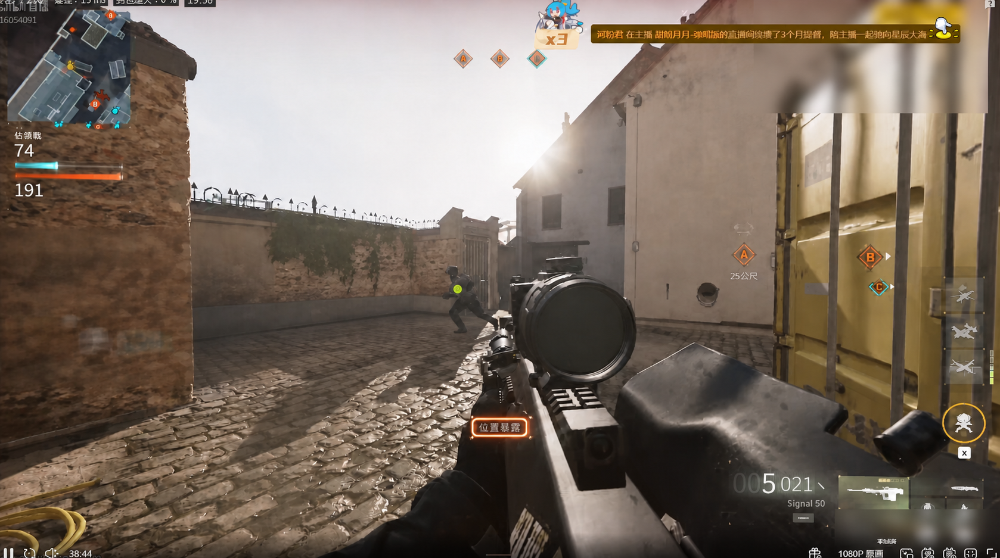

# Fusion Enemy Visibility Overlay V2 Plan

Date: 2026-08-30
Status: implemented candidate; offline gates pass; live MW4 acceptance pending
Scope: visual presentation of the currently selected Vision target

## Goal

Make dark but correctly detected enemies easier for the player to see by drawing
one small marker at the selected enemy's actual selector target point. The marker must remain visible to the
player while being absent from every frame consumed by `DxgiRoiCapture`, Vision,
cue processing, ego-motion observation, target selection and control.

The feature is presentation-only. It must not create target, aim, fire, recoil or
continuation authority.

Visual reference:



The image is an ImageGen mockup based on a user-provided gameplay frame. It is a
visual alignment reference, not pixel-faithful capture evidence or a regression
fixture.

## Architecture Decision

Reuse the prior fusion architecture and replace its unsafe or approximate
boundaries. Do not restart from an empty implementation.

Retain:

- separate `fusion_canvas.exe` process;
- non-blocking latest-only shared-memory publisher;
- DirectComposition, D3D11 and Direct2D rendering;
- default target-only output and default-off feature flag;
- independent canvas lifecycle and `FUSION_FORCE_OFF` kill switch.

Rework:

- capture exclusion from best-effort logging into a fail-closed state machine;
- IPC coordinate and timestamp contract;
- marker anchor and age policy;
- cross-process mouse passthrough for the full-screen presentation window;
- testability of the monolithic canvas implementation;
- display/device/DWM recovery and revalidation.

Defer automatic game-process identification. It may later improve automatic
show/hide and monitor selection, but it is not the owner of capture isolation.

## Hard Invariants

1. The canvas does not render a target marker until capture isolation is proven.
2. A failed, missing, stale or ambiguous isolation result keeps the canvas fully
   transparent and disables fusion publication for the session.
3. The proof uses the production `DxgiRoiCapture` path, not a different screenshot
   API.
4. The raw captured ROI contains neither the live marker nor the isolation probe.
5. Captured game content remains nonblank and continues updating during the probe.
6. Window, DWM, graphics-device, display-topology or capture-output recreation
   invalidates the proof and requires revalidation.
7. Selector, controller, AutoFire and recoil semantics remain unchanged. The
   only Vision scheduling change is the explicit 60 Hz non-aim idle cadence.
8. The Canvas never activates and never owns mouse input. Clicks, wheel input and
   pointer movement continue to the game or desktop window underneath it.
9. No production injection, Present hook, driver, game memory access or
   anti-cheat workaround.

## Implemented Candidate Flow

```text
VisionResult (selected target only)
  -> FusionChannelPublisher v2 (latest-only, non-blocking)
  -> fusion_canvas starts transparent
  -> affinity + DWM preflight
  -> canvas presents a short encoded isolation probe
  -> production DxgiRoiCapture scans the matching raw ROI
  -> verified: allow target marker rendering
  -> failed/uncertain: remain transparent and disable fusion
```

The isolation probe is startup/recovery work, not a per-frame cost. It must have
a unique pixel signature, a known physical-screen position inside the current
capture ROI and a canvas-side present sequence. The capture side checks several
fresh frames after that present sequence. Absence of the signature alone is not
enough: the captured ROI must also be nonblank and advancing.

## Capture Isolation Gate

Before the first visible marker:

1. Create the top-level overlay window but keep its target-marker scene empty.
2. Confirm `DwmIsCompositionEnabled`.
3. apply `WDA_EXCLUDEFROMCAPTURE` with `SetWindowDisplayAffinity`;
4. read the value back with `GetWindowDisplayAffinity`;
5. initialize DirectComposition and render the encoded probe;
6. scan frames produced by the same `DxgiRoiCapture` instance used by Vision;
7. publish one of `Verified`, `Failed`, or `Invalidated` to the canvas;
8. permit normal rendering only in `Verified`.

No production option may downgrade a failed hard gate into a warning. A test-only
build may expose an unsafe rendering mode for fixture development, but release
binaries must not.

## Input Transparency Gate

The presentation window uses `WS_EX_LAYERED | WS_EX_TRANSPARENT` together with
`WS_EX_NOACTIVATE`, and is created disabled with `WS_DISABLED`. It must not use
`WS_EX_NOREDIRECTIONBITMAP`: returning `HTTRANSPARENT` from `WM_NCHITTEST` only
continues hit testing to windows owned by the same thread and therefore cannot
make a full-screen Canvas transparent to a separate game process. On the tested
Windows/DComp path, layered transparency without the disabled state was also
insufficient, so all three properties are one hard contract.

`--verify-input-passthrough` creates a small topmost target on a worker thread,
places a production-style Canvas window above it, sends one contained click and
requires the worker window to receive `WM_LBUTTONDOWN`. The probe restores the
cursor and exits; it is an explicit diagnostic and is not part of normal startup.
The global F10/F11 controls are registered to the Canvas thread, not the disabled
window, so presentation and user-input ownership stay separate.

## Coordinate Contract

The current `virtual-screen center + dx/dy` mapping is only approximately correct.
IPC v2 should carry enough physical-pixel geometry to make the transform explicit:

- selected DXGI output desktop origin;
- capture ROI origin and size within that output;
- output/display topology generation;
- selector target-point and body-box coordinates in capture-ROI physical pixels;
- producer QPC timestamp and target generation;
- direct/continuation evidence state required by display policy.

The canvas computes virtual-desktop physical coordinates from this published
geometry. It rejects mismatched topology generations instead of guessing.

## Marker Contract

Initial visual policy, aligned with the demo:

- exactly one marker for the selected enemy;
- anchor directly at the normalized selector `target_x/target_y` point;
- do not derive a second visual point from the body-box top, head or height;
- 12 px core diameter at 1080p plus the black edge, scaled conservatively and capped;
- black outer edge, thin white ring and bright yellow-green center;
- no glow, box, outline, arrow, label, distance, animation or trail;
- hide instead of drawing when the anchor or target identity is ambiguous;
- use producer timestamp for age; do not refresh TTL merely because the canvas
  reread the same slot.

The exact stale interval remains a measured parameter. Evaluate 80, 100 and
120 ms against marker flicker and false lingering; do not retain the existing
250 ms value without evidence.

## Idle Vision Cadence

When the controller is not aiming, keep-warm Vision polling runs at 60 Hz instead
of 20 Hz. This reduces the scheduler-only worst-case wait from 50 ms to about
16.7 ms. It does not raise the Canvas DWM commit cap, change ADS/BodyLock cadence,
or grant control authority to an idle result. Detector inference time and a wrong
selector identity remain separate latency owners.

## Work Packages

### WP0 - Freeze RED Contracts

- Add capture-isolation state-machine tests that fail against the current
  log-and-continue behavior.
- Add coordinate fixtures for primary, secondary and negative-origin monitors.
- Add stale-slot and topology-generation mismatch fixtures.
- Freeze the demo marker contract and do not tune tests from candidate output.

### WP1 - Extract Testable Canvas Components

- Split affinity/isolation, coordinate mapping, renderer and app lifecycle from
  the current monolithic `fusion_canvas.cpp` only as required for focused tests.
- Preserve the existing DirectComposition renderer and IPC process boundary.

### WP2 - Fusion Channel V2

- Add explicit timestamps, target generation, evidence state and capture/output
  geometry.
- Keep double-buffer latest-only publication with no hot-path waits, allocations,
  file I/O or retries.
- Reject incompatible versions and stale/malformed slots.

### WP3 - End-to-End Capture Exclusion Probe

- Implement the canvas probe/present handshake.
- Add a one-time small-region capture check through `DxgiRoiCapture`.
- Fail closed on API, readback, probe, blank-frame or timeout failure.
- Re-run after canvas, DWM, device, topology or capture-output recreation.

### WP4 - Marker Rendering And Lifecycle

- Implement the marker contract and absolute physical-pixel mapping.
- Draw only the selected target; keep all-detection rendering debug-only.
- Replace arrival-time staleness with producer-time age.
- Keep the canvas fully transparent with no eligible target.

### WP5 - Verification And Live A/B

- Build `fusion_canvas` and `cod_native_runtime` in Release.
- Run focused fusion/capture tests, full CTest and native architecture/product
  gates relevant to Vision identity, lifecycle, AutoFire and output safety.
- Record side-by-side raw Vision frames and on-monitor observation: marker visible
  to the player, absent from raw capture.
- Run matched fusion-off/on performance sessions using the same resolution,
  refresh rate, model, capture FPS and gameplay scene.
- Live-check dark MW4 scenes, bright backlight, camera turns, target handoff,
  death/loss, alt-tab and canvas restart.

## Performance Gates

- Publisher p95 remains at or below 0.10 ms and never waits for the canvas.
- Capture/result cadence does not lose more than 1% in a matched run.
- Capture-to-result p95 does not regress by more than 0.25 ms.
- Canvas render p95 remains below 1 ms for the single-marker mode.
- No new controller tick, ViGEm delivery or output-jitter regression.
- Any DirectFlip/MPO/game-frame-time regression blocks live enablement even when
  the marker itself renders correctly.

These are eligibility gates, not additive scores. A gain in visibility cannot
waive a capture-isolation, lifecycle, identity or performance failure.

## Expected File Scope

Likely modifications:

- `native/overlay_canvas/fusion_canvas.cpp`
- `native/shared_fusion/fusion_channel.h`
- `native/shared_fusion/fusion_channel.cpp`
- `native/runtime_app/fusion_channel_publisher.h`
- `native/runtime_app/fusion_channel_publisher.cpp`
- `native/runtime_app/runtime_loop.cpp`
- `native/vision_native/include/vision_native/dxgi_capture.h`
- `native/vision_native/src/dxgi_capture.cpp`
- `native/vision_native/CMakeLists.txt`
- `scripts/launch/gamepad_fusion_canvas_start.bat`

Expected new focused units may include:

- `native/overlay_canvas/capture_isolation_guard.*`
- `native/overlay_canvas/fusion_coordinate_mapper.*`
- focused native tests for isolation, mapping and marker lifecycle.

## Non-Goals

- training or changing the detector;
- identifying MW4 versus BO7 by process name;
- process-specific audio capture;
- feeding the displayed marker back into Vision or target selection;
- displaying every detection, wall boxes or player outlines;
- controller, ADS, BodyLock, AutoFire or recoil tuning;
- injection, hooking or anti-cheat evasion.

## Delivery Definition

The work is complete only when all of the following are true:

- the user-visible marker matches the approved visual reference;
- the same session proves the marker is absent from production raw capture;
- any isolation uncertainty fails closed;
- coordinate and target lifecycle fixtures pass;
- relevant native regression and performance gates pass;
- a matched MW4 live session confirms the marker improves visibility without
  visible lag, stale placement or gameplay-performance regression.

## Implementation Record

Implemented on 2026-08-30:

- Fusion IPC version 2 publishes DXGI output origin/size, ROI origin, producer
  QPC timestamp, selector generation and direct-observation state.
- The marker is anchored directly at the selector-owned normalized target point,
  which is normally the pose-aware upper-chest aim point. It uses a black edge,
  white ring and yellow-green center. Malformed targets remain hidden; same-generation,
  selector-confirmed cue hold may continue only within the 120 ms visual TTL.
- Non-aim keep-warm Vision cadence is 60 Hz in the product config, example
  config, runtime profile defaults and `VisionServiceOptions`. Idle snapshots
  still have no controller authority.
- Marker TTL is 120 ms from the publisher QPC timestamp. Rereading a shared
  slot cannot extend it.
- Canvas state ingestion is event-driven. IPC signals are consumed before the
  render-rate cap, short direct bursts are latched until one render, DWM
  presents are nonblocking, and a waitable timer owns render/expiry/isolation
  deadlines. Idle operation no longer redraws at 30 FPS.
- Startup now runs an actual Desktop Duplication probe through
  `DxgiRoiCapture`. Before isolation, the magenta DirectComposition probe and a
  cyan control window must both be captured. After isolation, the control must
  remain while the same magenta probe must be absent.
- The top-level Canvas now uses a layered, transparent and disabled mouse path.
  Both style sets are checked at creation and the process exits before showing
  the window if the complete click-through contract cannot be established.
- The normal canvas requires DWM composition plus successful set/readback of
  `WDA_EXCLUDEFROMCAPTURE`. It exits fail-closed if those checks fail or if a
  display/DWM topology change invalidates the startup proof.
- The launcher does not start the canvas or native runtime when the capture
  probe fails.
- `gamepad_fusion_background_start.vbs` runs the DXGI gate first, then verifies
  the native PID/path/session. If native is absent, it launches
  `gamepad_native_background_start.ps1` hidden, waits for its owned state, and
  starts Canvas on the same session. An existing owned Canvas no longer causes
  an early return before native recovery.
- `gamepad_native_background_start.vbs` remains available for native-only
  standby. `gamepad_fusion_background_stop.vbs` stops only the recorded Canvas
  PID, so native remains resident for a later Fusion attach.

Measured local evidence:

- pre-fix RED: target-point layout was missing, idle profiles returned 20 Hz,
  Fusion start rejected a missing native state, and a production-style
  cross-thread mouse probe was blocked with style `0x082000a8`;
- post-fix contract result: pass;
- mouse gate: the same probe passes with layered style `0x080800a8` and
  `WS_DISABLED`; both the enabled legacy path and disabled no-redirection
  counterfactual remain blocked;
- two-phase DXGI gate: `visible_probe_pixels=5184`,
  `excluded_probe_pixels=0`, `control_pixels=5184`, capture `640x512`, output
  origin `(0,0)`, ROI origin `(640,284)`;
- Release builds: `fusion_canvas`, `cod_native_runtime` and
  `vision_native_cpp` pass;
- relevant CTest suites: 11/11 pass, including ADS, BodyLock, AutoFire/Marker,
  runtime freshness, Vision selection and end-to-end suites.
- frozen 120 FPS MW4 fixture: legacy policy shows 0/2 fixed render ticks and
  hides two confirmed gaps; the candidate shows 2/2 and hides zero;
- supplied-video audit status: `INSUFFICIENT_EVIDENCE` for the original live
  runtime cause because executable identity, hardware/refresh covariates and
  live publish/render timestamps are absent.

Remaining acceptance work:

- The startup probe uses a fresh `DxgiRoiCapture` instance on the same selected
  output and production implementation; the long-lived runtime capture instance
  is created after the gate. Normal-canvas affinity is independently read back
  and monitored, but a cross-process runtime/canvas probe handshake is not part
  of this candidate.
- Matched fusion-off/on performance telemetry and the live MW4 scene matrix have
  not been run. Until they pass, this is an implementation candidate rather than
  a live-accepted release.
- The contained cross-thread probe proves Windows mouse routing through the
  production window style. A short live check should still confirm normal MW4
  menus, desktop clicks and alt-tab behavior in the user's exact display mode.
- The supplied replay exposes a separate early detector/selector failure. A
  large false person box owns the selector generation before the correct enemy
  box. Event-driven Canvas work cannot remove that acquisition latency; it needs
  a separate frozen detector/identity regression and data decision.

Background usage order:

1. Run `scripts/launch/gamepad_fusion_background_start.vbs`. It performs the
   capture-isolation preflight, starts native automatically when absent, then
   starts Canvas and waits until the shared channel is connected.
2. Run `scripts/launch/gamepad_fusion_background_stop.vbs` to remove only the
   Canvas. Native and its controller lifecycle remain running.
3. Run the Fusion start VBS again to reattach Canvas to that resident native.
4. Run `scripts/launch/gamepad_native_background_stop.vbs` when native itself
   should stop. Use `gamepad_native_background_start.vbs` only when native-only
   standby is wanted.

An unowned native process launched outside the background lifecycle is not
adopted or terminated. Stop it first, then use the Fusion start VBS so PID,
executable path and session ownership can be proven.
