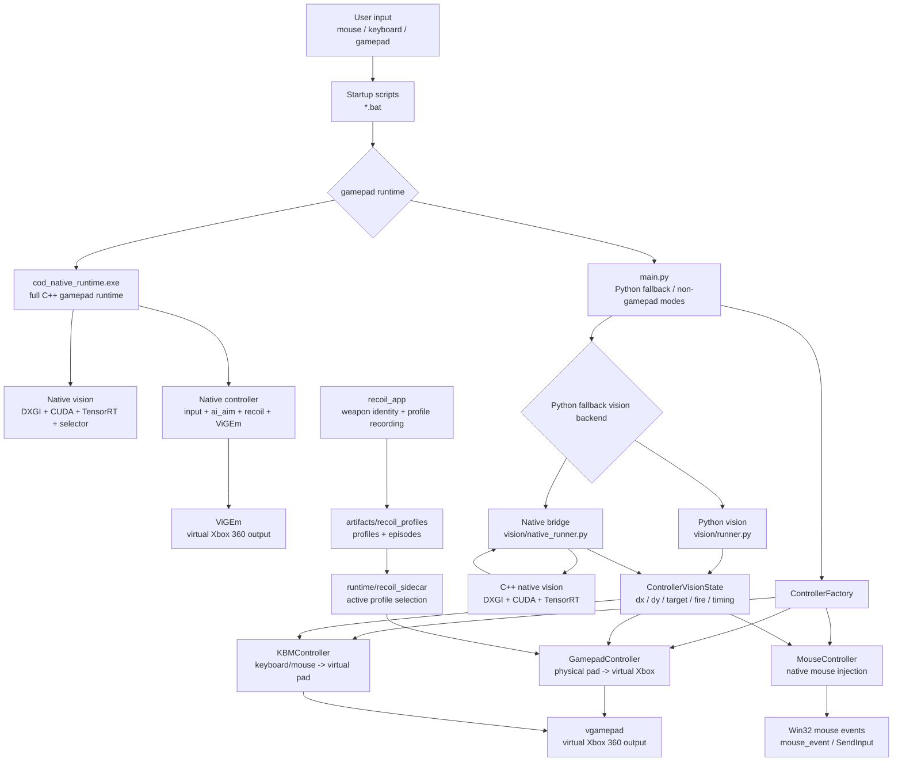
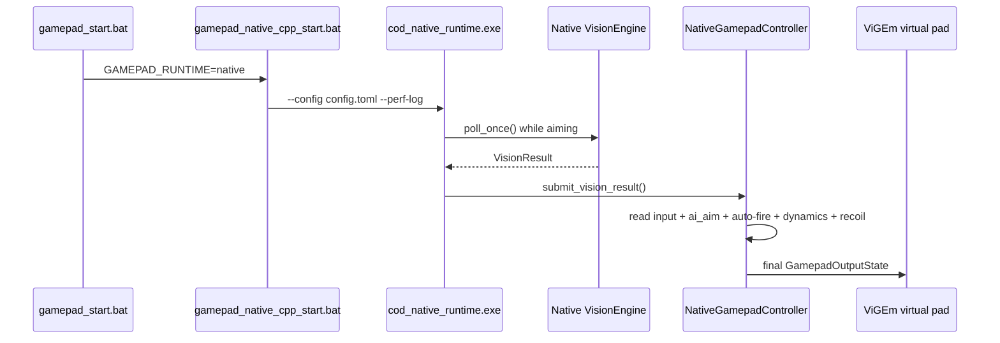
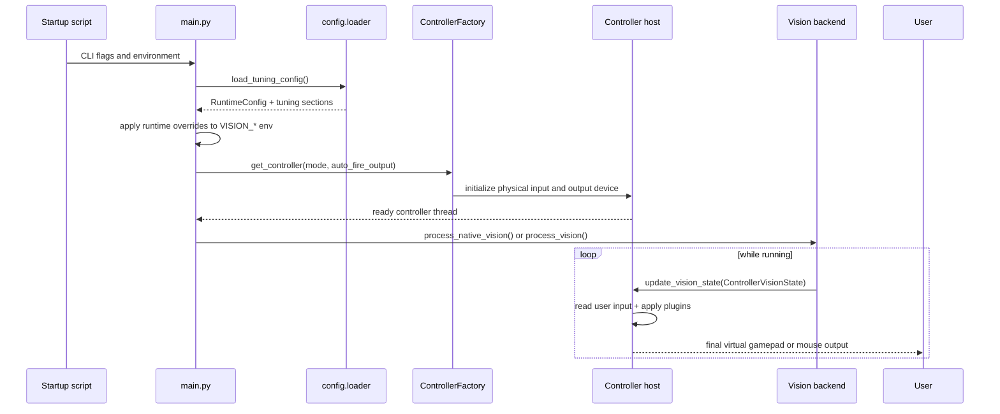
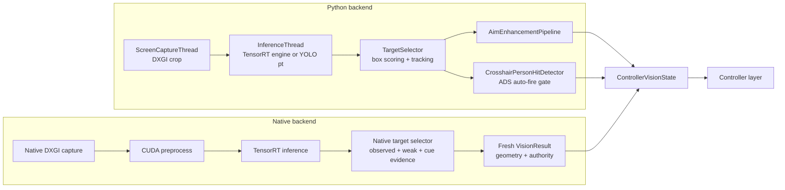
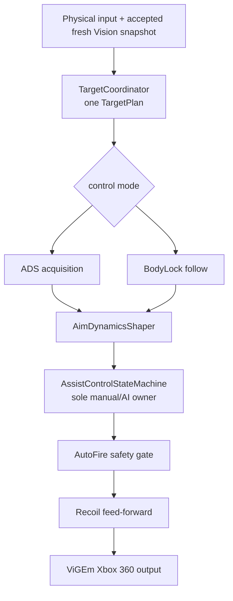
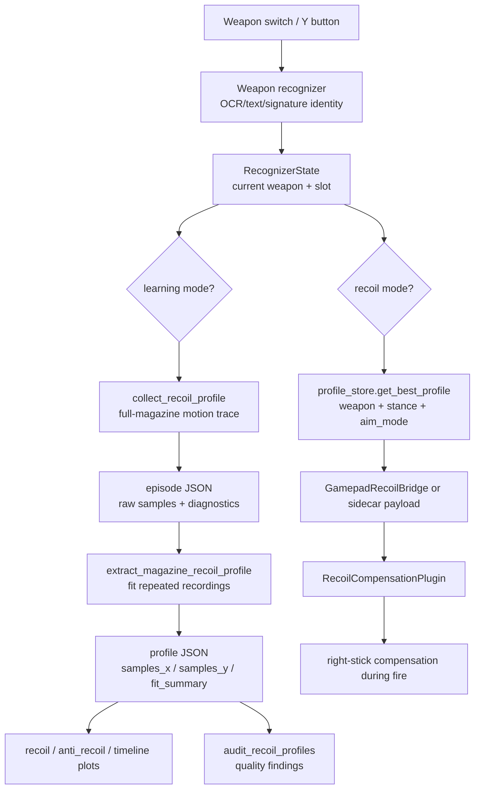

# Project Overview

Last reviewed: 2026-06-11

## Application Overview

This project is a Windows-focused real-time vision and controller-assist research app for FPS-style gameplay. The normal live gamepad entry point now starts a single native C++ runtime. That runtime captures a small region around the crosshair, runs TensorRT person detection, selects one target, applies native controller logic, and writes the final output to a virtual Xbox 360 gamepad.

The system has six main moving parts:

- `scripts\launch\gamepad_start.bat` and `scripts\launch\gamepad_native_cpp_start.bat` choose the default native gamepad runtime.
- `native/runtime_app/` owns the C++ live loop.
- `native/vision_native/` produces target deltas, target authority, and auto-fire intent.
- `native/controller_native/` owns physical gamepad input, AI/manual mixing, auto-fire, recoil compensation, and ViGEm output.
- `main.py`, `vision/`, and `controllers/` remain for Python fallback modes, mouse/KBM modes, debug tooling, and tests.
- `recoil_app/`, `vision/recoil_collection/`, and `runtime/recoil_sidecar/` record weapon recoil profiles and expose matching profiles back to the gamepad runtime.

The mental model is: native vision decides "what should be aimed at"; the native gamepad controller decides "how much should the real output move while respecting current user input". Python is no longer the normal gamepad hot path.

## Current Situation

The default gamepad path is now full native C++ through `scripts\launch\gamepad_start.bat`. Set `GAMEPAD_RUNTIME=python` only when the older Python gamepad path is needed for fallback or comparison. Mouse and `kbm_to_gamepad` still use their Python hosts. The recoil system has grown into a side toolchain: it recognizes weapon identity, records full-magazine recoil evidence, writes profile artifacts and plots, and can feed matching profiles into native gamepad recoil playback.

This review is based on the current source tree, existing project docs, and `.agent-context/handoff.md`. The worktree contains existing uncommitted changes, so this overview is added as a standalone document rather than rewriting the older docs index.

## Repository Map

| Area | Role |
| --- | --- |
| `scripts/launch/gamepad_start.bat` | Normal gamepad entry point. Defaults to the full native C++ runtime. |
| `scripts/launch/gamepad_native_cpp_start.bat` | Direct native C++ gamepad launcher. |
| `native/runtime_app/` | C++ runtime executable and 1ms controller/vision polling loop. |
| `native/controller_native/` | Native gamepad controller, input readers, `ai_aim`, auto-fire, aim-assist dynamics, recoil, ViGEm output. |
| `main.py` | Python fallback and non-gamepad launcher. Creates Python controllers and starts native or Python vision when explicitly used. |
| `controllers/factory.py` | Factory for `gamepad`, `mouse`, and `kbm_to_gamepad` controller hosts. |
| `controller.py` | Compatibility shim that re-exports `ControllerFactory` for older imports. |
| `config/loader.py` | TOML-backed runtime and tuning config loader. |
| `controllers/base_controller.py` | Shared controller contract and `ControllerVisionState` handoff model. |
| `controllers/gamepad_controller.py` | Python fallback physical-gamepad to virtual-Xbox host. |
| `controllers/gamepad/` | Python fallback gamepad plugins and historical tuning reference. |
| `controllers/mouse_controller.py` | Native mouse-output host with injected movement, click handling, and telemetry. |
| `controllers/mouse/` | Mouse plugins: AI aim, auto-fire, recoil, frame/output models. |
| `vision/runner.py` | Python vision fallback: capture, inference, target selection, enhancement, auto-fire gate. |
| `vision/native_runner.py` | Python bridge for the native C++ vision module; not the default gamepad runtime. |
| `native/vision_native/` | C++ / CUDA / TensorRT vision path, pybind module, and runtime build output. |
| `vision/recoil_collection/` | Recoil recording, segmentation, extraction, readiness/audit, calibration, and profile storage models. |
| `recoil_app/` | Console/runtime layer for weapon identity, profile recording, state publishing, and plots. |
| `runtime/recoil_sidecar/` | File/state based bridge that selects active recoil profiles for the controller runtime. |
| `scripts/launch/` | Full startup script implementations; root `.bat` files call into these scripts as compatibility shims. |
| `tools/` | Build, smoke, benchmark, training, recoil audit, dry-run playback, and diagnostic helpers. |
| `tests/` | Unit and integration-style coverage for vision bridge, controllers, recoil, config, startup scripts, and tools. |
| `docs/project/` | Current overview, architecture, benchmark, validation, and debugging docs. |
| `docs/superpowers/` | Historical specs and implementation plans. |

## Top-Level Architecture



## Runtime Startup Flow

Default gamepad flow:



Python fallback and non-gamepad flow:



## Vision Backend Flow

The default C++ gamepad runtime no longer needs the Python controller boundary. The Python boundary still matters for fallback, mouse, `kbm_to_gamepad`, tests, and debug tools.



## Controller Pipeline Flow

The controller layer is where user input and AI intent are arbitrated. In the default gamepad path this layer is native C++; in Python fallback modes it is the Python controller plugin host. Vision should not directly actuate buttons or sticks; it only supplies intent.



### Gamepad Mode

The default gamepad mode is `cod_native_runtime.exe`. It reads a physical gamepad through native input readers, mirrors output to a ViGEm Xbox 360 controller, and runs the native controller pipeline before writing final output.

`GamepadController` is now the Python fallback host. It reads a physical gamepad through `pygame`, mirrors it to a virtual Xbox 360 controller through `vgamepad`, and runs a plugin chain before writing final output.

Current native gamepad order:

1. `TargetCoordinator` publishes one source-owned target plan.
2. ADS acquisition or BodyLock computes one target-relative proposal.
3. `AimDynamicsShaper` shapes the proposal once.
4. `AssistControlStateMachine` owns manual/AI authority and handover.
5. AutoFire applies only its safety-gated synthetic fire contribution.
6. Recoil applies the final feed-forward before ViGEm.

Python fallback plugin order:

1. `AIAimPlugin`
2. `AutoFirePlugin`
3. `AimAssistDynamicsPlugin`
4. `RecoilCompensationPlugin`

### Mouse Mode

`MouseController` keeps the physical mouse active and injects additive mouse movement through Win32 APIs. It tracks manual motion, suppresses echoes from injected movement, can emit telemetry CSV files, and uses its own mouse plugin models.

### KBM To Gamepad Mode

`KBMController` is an older mode that translates keyboard/mouse input into a virtual gamepad. It is supported by the factory, but the newer plugin architecture is more developed in `gamepad` and `mouse`.

## Recoil Record And Replay Flow

The recoil feature is best understood as a separate evidence pipeline that feeds the gamepad plugin. Weapon recognition chooses the current weapon, recording captures repeated full-magazine motion, extraction fits a profile, plots make the profile inspectable, and runtime selection hands the matching profile to the controller.



Current recoil behavior from the latest handoff:

- Runtime playback is permissive for trial use: a saved profile may be used when `game`, weapon id, stance, and aim mode match.
- Quality findings such as low support, low confidence, or suspicious curves are still surfaced by audit/status tooling.
- The clean-data workflow should still record multiple full magazines and inspect plots before treating a profile as trustworthy.

## Core Data Contracts

| Contract | Producer | Consumer | Purpose |
| --- | --- | --- | --- |
| `VisionResult` | `native/vision_native` | `native/runtime_app`, `native/controller_native` | Default gamepad target delta, target metadata, authority fields, auto-fire request, and timing fields. |
| `ControllerVisionState` | `vision/runner.py`, `vision/native_runner.py` | Python fallback controller hosts | Atomic target delta, target metadata, auto-fire request, and timing fields. |
| `ControllerTarget` | vision backends | controller plugins | Aim point, screen center, body box, source, and observed timestamp. |
| `GamepadFrame` / `GamepadOutput` | `GamepadController` | gamepad plugins and virtual output | Snapshot of physical input plus latest vision state, then mutable output. |
| `MouseFrame` / `MouseOutput` | `MouseController` | mouse plugins and injector | Snapshot of manual mouse state plus latest vision state, then movement/click output. |
| `RecognizerState` | recoil app / weapon recognizer | recoil runtime and sidecar | Current weapon identity and profile candidates. |
| `RecoilProfileRecord` | recoil extraction | recoil app, sidecar, gamepad plugin | Cumulative recoil samples, metadata, confidence, support counts, and fit summary. |

## Review Findings

### Strengths

- The default gamepad runtime is now C++ end to end, so live-play latency and behavior can be investigated without Python/native handoff overhead.
- The default gamepad path has a clear native pipeline, so aim assist, auto-fire, aim-assist dynamics, recoil, and diagnostics can be reasoned about independently.
- Python remains useful for fallback, tooling, tests, and non-gamepad modes, but it should not be assumed to be part of the live gamepad hot path.
- Recoil recording now has a real artifact model: profiles, episodes, plots, audit tooling, dry-run playback, and runtime selection.
- The test suite is broad for a research codebase: controller, mouse, gamepad, recoil collection, recoil app, sidecar, config, startup, and native bridge coverage all exist.

### Risks And Gaps

- Documentation freshness is mixed. Some older docs describe stricter recoil readiness gates than the latest handoff, where runtime playback is intentionally permissive for trial use.
- Runtime config comes from `config.toml`, environment variables, CLI flags, and startup scripts. That is powerful, but live debugging needs explicit logs to avoid guessing which layer won.
- Native and Python fallback behavior intentionally differ in some areas. Treat parity tests as contract tests plus documented policy differences, not as proof that all live behavior is identical.
- Recoil playback is still sensitive to recording quality and game/controller sensitivity. A matching profile file does not automatically mean the curve is trustworthy.
- The project is tightly coupled to Windows desktop capture, Win32 input APIs, virtual gamepad drivers, CUDA, TensorRT, and local hardware state. CI-style verification can cover logic, but live validation remains necessary.
- Current worktree state includes unrelated modified files; architecture documentation should be staged separately from feature/debug work.

## Suggested Reading Order

1. `README.md`
2. `docs/project/NATIVE_CPP_RUNTIME.md`
3. `docs/project/PROJECT_OVERVIEW.md`
4. `docs/project/VISION_OVERVIEW.md`
5. `docs/project/NATIVE_VISION.md`
6. `docs/project/CONTROLLER_OVERVIEW.md`
7. `docs/project/GAMEPAD_OVERVIEW.md`
8. `docs/project/MOUSE_OVERVIEW.md`
9. `docs/project/RECOIL_RECORD_REPLAY_VALIDATION.md`
10. `.agent-context/handoff.md`

## Verification Entry Points

Use focused suites before full discovery because some live/hardware paths are environment-sensitive.

```powershell
scripts\verify\native_pipeline_contract.bat
```

Use the native pipeline contract before live acceptance when changing
`vision -> tracker -> controller -> recoil`. It rejects known recoil/controller
coupling regressions, runs native controller behavior tests, runs a one-tick
runtime smoke, verifies `tracker_motion=component_aware_final`, and runs a
short native gamepad benchmark smoke.

For broader native runtime launcher/scaffold checks:

```powershell
powershell -ExecutionPolicy Bypass -File tools\check_native_cpp_gamepad_runtime.ps1 -BuildFirst
```

This broader check calls the core pipeline contract by default; pass
`-SkipPipelineContract` only when isolating launcher/scaffold failures.

```powershell
py -3 -B -m unittest tests.test_main_cli tests.test_startup_scripts tests.test_config_loader -v
```

```powershell
py -3 -B -m unittest tests.test_native_vision_runner tests.test_native_vision_synthetic_parity tests.test_native_vision_targeting_bridge -v
```

```powershell
py -3 -B -m unittest discover -s tests/gamepad -p "test_*.py" -v
```

```powershell
py -3 -B -m unittest discover -s tests/mouse -p "test_*.py" -v
```

```powershell
py -3 -B -m unittest tests.recoil_collection.test_audit tests.recoil_collection.test_capture tests.recoil_collection.test_extraction tests.recoil_collection.test_readiness tests.recoil_collection.test_calibration tests.recoil_app.test_runtime tests.runtime.test_recoil_sidecar_service tests.recoil_collection.test_playback_dry_run -v
```

For live smoke, restart the relevant `.bat` script after config changes so the runtime reloads config and env state.
