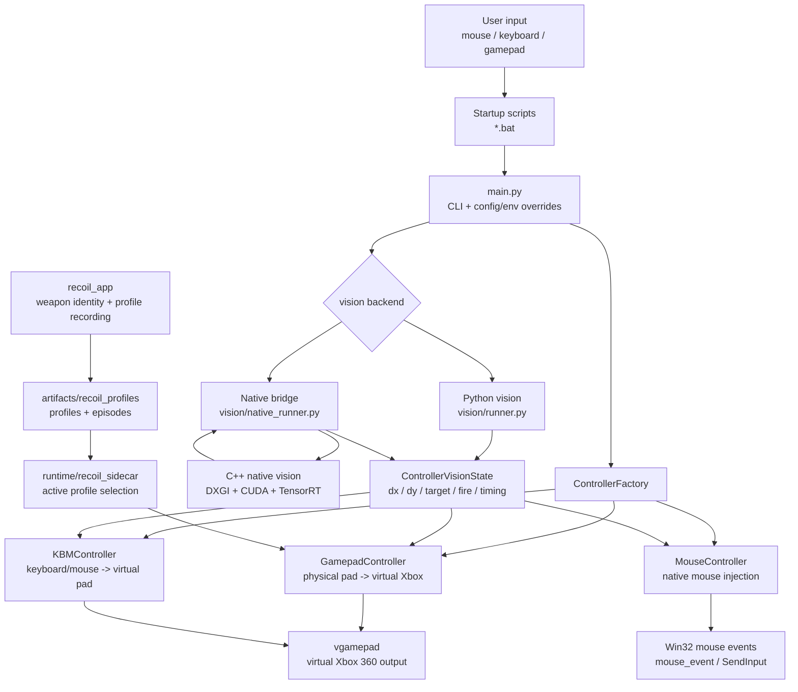
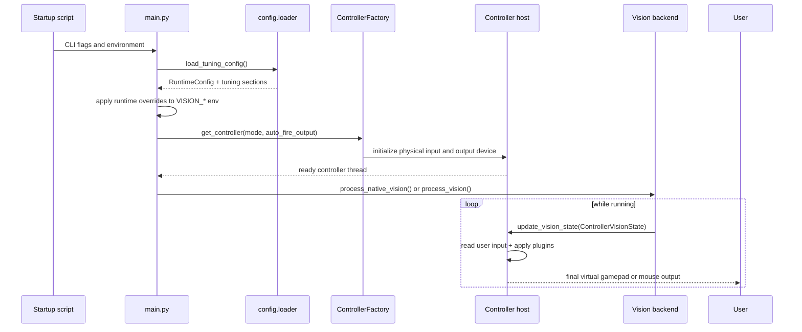
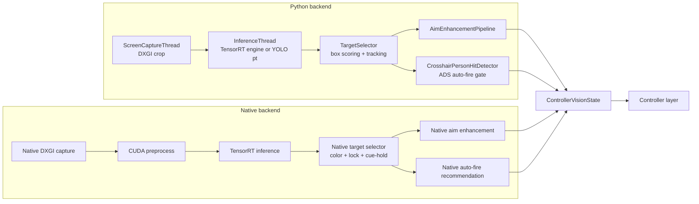
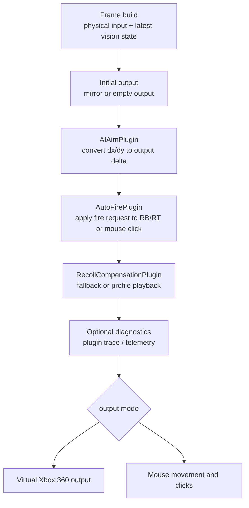
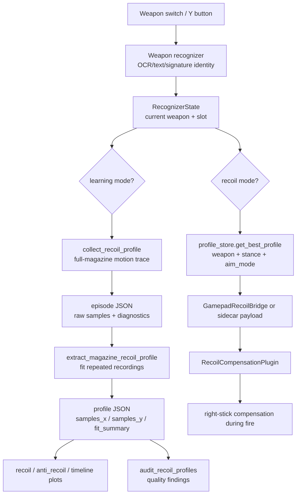

# Project Overview

Last reviewed: 2026-05-21

## Application Overview

This project is a Windows-focused real-time vision and controller-assist research app for FPS-style gameplay. The user runs one of the startup scripts, the app captures a small region around the crosshair, detects and selects a target, then sends compact aim/fire intent into a controller host. The controller host reads real user input, mixes optional AI assistance or recoil compensation, and writes the final output to either a virtual Xbox 360 gamepad or native mouse events.

The system has four main moving parts:

- `main.py` and startup scripts choose the runtime mode and apply config/env overrides.
- `vision/` and `native/vision_native/` produce target deltas and auto-fire intent.
- `controllers/` owns physical input, AI/manual mixing, auto-fire, recoil compensation, and device output.
- `recoil_app/`, `vision/recoil_collection/`, and `runtime/recoil_sidecar/` record weapon recoil profiles and expose matching profiles back to the gamepad runtime.

The mental model is: vision decides "what should be aimed at"; controllers decide "how much should the real output move while respecting current user input".

## Current Situation

The default gamepad path now favors native vision through `gamepad_start.bat`, while Python vision remains available for comparison and fallback. Gamepad and mouse modes are both plugin-based, but the gamepad path is the more mature assisted-controller runtime. The recoil system has grown into a side toolchain: it recognizes weapon identity, records full-magazine recoil evidence, writes profile artifacts and plots, and can feed matching profiles into gamepad recoil playback.

This review is based on the current source tree, existing project docs, and `.agent-context/handoff.md`. The worktree contains existing uncommitted changes, so this overview is added as a standalone document rather than rewriting the older docs index.

## Repository Map

| Area | Role |
| --- | --- |
| `main.py` | Unified CLI launcher. Creates a controller and starts native or Python vision. |
| `controllers/factory.py` | Factory for `gamepad`, `mouse`, and `kbm_to_gamepad` controller hosts. |
| `controller.py` | Compatibility shim that re-exports `ControllerFactory` for older imports. |
| `config/loader.py` | TOML-backed runtime and tuning config loader. |
| `controllers/base_controller.py` | Shared controller contract and `ControllerVisionState` handoff model. |
| `controllers/gamepad_controller.py` | Physical gamepad to virtual Xbox 360 host with plugin pipeline. |
| `controllers/gamepad/` | Gamepad plugins: AI aim, auto-fire, recoil, manual guards, diagnostics, weapon switch recognition. |
| `controllers/mouse_controller.py` | Native mouse-output host with injected movement, click handling, and telemetry. |
| `controllers/mouse/` | Mouse plugins: AI aim, auto-fire, recoil, frame/output models. |
| `vision/runner.py` | Python vision backend: capture, inference, target selection, enhancement, auto-fire gate. |
| `vision/native_runner.py` | Python bridge for the native C++ vision module. |
| `native/vision_native/` | C++ / CUDA / TensorRT hot vision path and pybind module. |
| `vision/recoil_collection/` | Recoil recording, segmentation, extraction, readiness/audit, calibration, and profile storage models. |
| `recoil_app/` | Console/runtime layer for weapon identity, profile recording, state publishing, and plots. |
| `runtime/recoil_sidecar/` | File/state based bridge that selects active recoil profiles for the controller runtime. |
| `scripts/launch/` | Full startup script implementations; root `.bat` files call into these scripts as compatibility shims. |
| `tools/` | Build, smoke, benchmark, training, recoil audit, dry-run playback, and diagnostic helpers. |
| `tests/` | Unit and integration-style coverage for vision bridge, controllers, recoil, config, startup scripts, and tools. |
| `docs/project/` | Current overview, architecture, benchmark, validation, and debugging docs. |
| `docs/superpowers/` | Historical specs and implementation plans. |

## Top-Level Architecture



## Runtime Startup Flow



## Vision Backend Flow

Both vision backends feed the same controller boundary. That is the main architectural stabilizer: native and Python can differ internally, but controllers should keep receiving the same compact state.



## Controller Pipeline Flow

The controller layer is where user input and AI intent are arbitrated. Vision should not directly actuate buttons or sticks; it only supplies intent.



### Gamepad Mode

`GamepadController` reads a physical gamepad through `pygame`, mirrors it to a virtual Xbox 360 controller through `vgamepad`, and runs a plugin chain before writing final output. It also hosts the recoil profile lookup path through either the in-process `GamepadRecoilBridge` or the sidecar service.

Current default plugin order:

1. `AIAimPlugin`
2. `AutoFirePlugin`
3. `RecoilCompensationPlugin`

### Mouse Mode

`MouseController` keeps the physical mouse active and injects additive mouse movement through Win32 APIs. It tracks manual motion, suppresses echoes from injected movement, can emit telemetry CSV files, and uses its own mouse plugin models.

### KBM To Gamepad Mode

`KBMController` is an older mode that translates keyboard/mouse input into a virtual gamepad. It is supported by the factory, but the newer plugin architecture is more developed in `gamepad` and `mouse`.

## Recoil Record And Replay Flow

The recoil feature is best understood as a separate evidence pipeline that feeds the gamepad plugin. Weapon recognition chooses the current weapon, recording captures repeated full-magazine motion, extraction fits a profile, plots make the profile inspectable, and runtime selection hands the matching profile to the controller.



Current recoil behavior from the latest handoff:

- Runtime playback is permissive for trial use: a saved profile may be used when `game`, weapon id, stance, and aim mode match.
- Quality findings such as low support, low confidence, or suspicious curves are still surfaced by audit/status tooling.
- The clean-data workflow should still record multiple full magazines and inspect plots before treating a profile as trustworthy.

## Core Data Contracts

| Contract | Producer | Consumer | Purpose |
| --- | --- | --- | --- |
| `ControllerVisionState` | `vision/runner.py`, `vision/native_runner.py` | controller hosts | Atomic target delta, target metadata, auto-fire request, and timing fields. |
| `ControllerTarget` | vision backends | controller plugins | Aim point, screen center, body box, source, and observed timestamp. |
| `GamepadFrame` / `GamepadOutput` | `GamepadController` | gamepad plugins and virtual output | Snapshot of physical input plus latest vision state, then mutable output. |
| `MouseFrame` / `MouseOutput` | `MouseController` | mouse plugins and injector | Snapshot of manual mouse state plus latest vision state, then movement/click output. |
| `RecognizerState` | recoil app / weapon recognizer | recoil runtime and sidecar | Current weapon identity and profile candidates. |
| `RecoilProfileRecord` | recoil extraction | recoil app, sidecar, gamepad plugin | Cumulative recoil samples, metadata, confidence, support counts, and fit summary. |

## Review Findings

### Strengths

- The vision-to-controller boundary is narrow and explicit, which makes native/Python vision backend swaps possible without rewriting controller logic.
- The default gamepad path has a clear plugin pipeline, so aim assist, auto-fire, recoil, and diagnostics can be reasoned about independently.
- Native vision owns the hot path where latency matters most, while Python still owns startup, orchestration, tests, and fallback behavior.
- Recoil recording now has a real artifact model: profiles, episodes, plots, audit tooling, dry-run playback, and runtime selection.
- The test suite is broad for a research codebase: controller, mouse, gamepad, recoil collection, recoil app, sidecar, config, startup, and native bridge coverage all exist.

### Risks And Gaps

- Documentation freshness is mixed. Some older docs describe stricter recoil readiness gates than the latest handoff, where runtime playback is intentionally permissive for trial use.
- Runtime config comes from `config.toml`, environment variables, CLI flags, and startup scripts. That is powerful, but live debugging needs explicit logs to avoid guessing which layer won.
- Native and Python vision intentionally differ on some gap behavior. Treat parity tests as contract tests plus documented policy differences, not as proof that all live behavior is identical.
- Recoil playback is still sensitive to recording quality and game/controller sensitivity. A matching profile file does not automatically mean the curve is trustworthy.
- The project is tightly coupled to Windows desktop capture, Win32 input APIs, virtual gamepad drivers, CUDA, TensorRT, and local hardware state. CI-style verification can cover logic, but live validation remains necessary.
- Current worktree state includes unrelated modified files; architecture documentation should be staged separately from feature/debug work.

## Suggested Reading Order

1. `README.md`
2. `docs/project/PROJECT_OVERVIEW.md`
3. `docs/project/VISION_OVERVIEW.md`
4. `docs/project/NATIVE_VISION.md`
5. `docs/project/CONTROLLER_OVERVIEW.md`
6. `docs/project/GAMEPAD_OVERVIEW.md`
7. `docs/project/MOUSE_OVERVIEW.md`
8. `docs/project/RECOIL_RECORD_REPLAY_VALIDATION.md`
9. `.agent-context/handoff.md`

## Verification Entry Points

Use focused suites before full discovery because some live/hardware paths are environment-sensitive.

```powershell
py -3 -B -m unittest tests.test_main_cli tests.test_startup_scripts tests.test_config_loader -v
```

```powershell
py -3 -B -m unittest tests.test_native_vision_runner tests.test_native_vision_synthetic_parity tests.test_native_vision_targeting_bridge -v
```

```powershell
py -3 -B -m unittest discover -s tests/gamepad -p "test_*.py" -v
```

```powershell
py -3 -B -m unittest discover -s tests/mouse -p "test_*.py" -v
```

```powershell
py -3 -B -m unittest tests.recoil_collection.test_audit tests.recoil_collection.test_capture tests.recoil_collection.test_extraction tests.recoil_collection.test_readiness tests.recoil_collection.test_calibration tests.recoil_app.test_runtime tests.runtime.test_recoil_sidecar_service tests.recoil_collection.test_playback_dry_run -v
```

For live smoke, restart the relevant `.bat` script after config changes so the runtime reloads config and env state.
