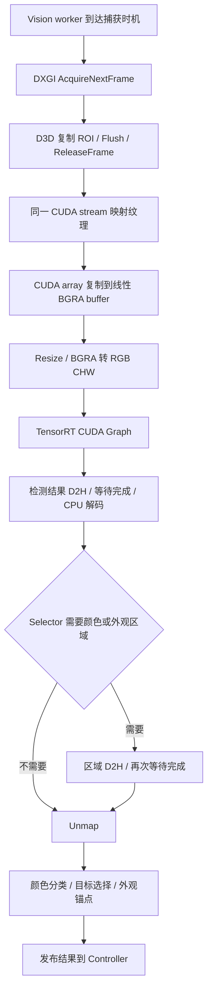

# Vision 性能分析与候选实施顺序

日期：2026-09-05。分析对象：`dev` 当前工作区，基于 `30014470af9ea09a673ffa29d8972a9da149ae93`，包含本次 native review 已交付的修复。

**有优化空间。优先研究捕获节奏、GPU 提交与同步、预处理的组织方式，再处理 Selector 的重复计算。** 当前证据不足以承诺具体提速百分比，也没有必要先替换已经使用 FP16 的模型。若要重构，优先试验共享 GPU 纹理与显式 fence 的数据通路。

本轮完成源码分析、历史性能数据复核和方案评估。用户正在主观测试已编译版本；本轮没有修改生产源码、配置、模型或启动程序，没有运行新 GPU 基准、启动 runtime 或编译。此前记录的 33 项源码和二进制哈希全部一致。[版本与分析输入清单](D:/work/AI/yolo-study-001/artifacts/vision-analysis-20260905/analysis-source-manifest.json)

## 当前路径与已有优化

实际配置为 `640×512` 捕获、`480×384` 固定推理张量，动态 viewport 关闭，active 请求 200 Hz，idle 请求 60 Hz，keepwarm 开启，颜色回读使用 pageable。详细 telemetry 与 performance summary 均关闭；因此用户这轮主观测试不会自动产生这些数值指标。[配置](D:/work/AI/yolo-study-001/config.toml:5)

读取当前 engine 的 JSON 前缀确认：YOLO26n、batch 1、`half=true`、`int8=false`、`dynamic=false`、`end2end=true`、`nms=false`。TensorRT 的输入输出 binding 要求 float32，并不意味着模型内部以 FP32 为主执行。输出代码接受 `[1,N,6]`，只做置信度过滤、坐标缩放和类别转换，没有 CPU NMS。[TensorRT 路径](D:/work/AI/yolo-study-001/native/vision_native/src/tensorrt_engine.cpp:152)

已经具备：固定 shape、启动时创建 TensorRT CUDA Graph、tensor 地址只绑定一次、high-priority nonblocking stream、检测输出 pinned buffer、长期注册 D3D ROI 纹理、latest-only 结果交付。前一轮还修复了同 stream 的 map/unmap 顺序。它们不能再算作本轮新增优化。[选项默认值](D:/work/AI/yolo-study-001/native/vision_native/include/vision_native/tensorrt_engine.h:23)

当前串行关系如下；GPU 运算与 CPU 等待的计时有重叠，图中的节点不能直接用已有统计均值相加。



本机 NVIDIA 查询返回 RTX 4070 SUPER、compute capability 8.9、驱动 591.59；CPU 为 i5-13600KF。Windows WMI 显示的 NVIDIA 名称为 GTX 970，与 NVIDIA 查询不一致，不能据该显示名称套用 Maxwell 的能力结论。构建缓存使用 CUDA architecture 75、TensorRT 10.15.1.29；本轮没有更改这些设置。历史会话只记录了宽泛的本机硬件标识，不能补写为已证明与今天完全相同。

## 历史证据能说明什么

审计结论：**INSUFFICIENT_EVIDENCE，针对当前版本性能与因果 A/B。** 所选历史日志内部身份及完整性核验通过，但游戏刷新率未知，详细日志与性能摘要同时启用，且程序不是今天的版本。以下数值用于筛选调查方向，不是今天的测量结果，也不是候选提速证明。

选取 `20260825T113443Z_11408_1`，其 capture/tensor 与当前相同，engine 哈希与当前文件一致。`tensorrt_engine.cpp`、`preprocess.cu`、`target_selector.cpp` 相对该会话的记录 commit 没有源码差异；capture/service 和观察时间等路径已有修复，仍必须重新测量。

| 身份 | 值 |
| --- | --- |
| 历史 runtime SHA-256 | `86a61717ff1cb9123a2a16294d4a903d85d9e14193e365e29d4a7f6825cc7622` |
| 历史 config SHA-256 | `54952b1eeaac52ae014903999b3e67bd8345a3abb2ce32aadf03c269f4f67f95` |
| 共同 engine SHA-256 | `45fc56274ff3bbc659e534c3b7833065b0483ef8022ac5d7657cd6da7dbdeb21` |
| 性能源 ID | `performance-summary` |
| 性能源 SHA-256 | `cfbf8eefa58f00b782d3f6deeeb20221a8a88f74656bc23023c4aae43a2e3715` |
| 性能 schema / logging | 2 / mixed |
| 新 intake artifact SHA-256 | `b2eaa9e04189c0b498946138d41d968c8f93567c23641e3f29d8ef8af7b1d0c6` |

在计算结果前固定分组：4.5–5.5 秒的窗口；idle 为 `aiming_ratio == 0`，过渡窗口为 `0 < ratio < 0.5`，以瞄准为主的窗口为 `ratio >= 0.5`。另设 `ratio >= 0.95` 为敏感性检查。没有用窗口时间或最近一行推断 ADS/BodyLock，也没有做跨时钟逐帧关联。

共 1,810 行，全部可解析；0 个损坏行、0 个时长排除窗口、0 个重复/重叠/逆序窗口。三个互斥组分别为 1,075 / 645 / 90 个窗口。源文件 writer drop 为 0；session 仍标记 active，因此时长只覆盖现存摘要。源文件及各字段身份在通用 preflight 之外再次直接核对。

下面采用 **90 个以瞄准为主的窗口、49,235 个 Vision 样本**。这些窗口仍可能含 idle 帧，不能称作逐帧纯 ADS 数据。均值按每个字段自己的样本数加权；P95 一列是“各窗口 P95 的中位数”，不是合并全部帧后的 P95。原始摘要采用 0.25 ms histogram 桶，亚 0.1 ms 阶段的分位数分辨率不足；详细 P50/P95/P99/max 保留在生成 JSON 中。

| 阶段 | 加权均值 ms | 窗口 P95 中位数 ms | 样本数 |
| --- | ---: | ---: | ---: |
| Capture acquire begin → result | 5.252 | 7.875 | 49,235 |
| D3D copy 提交完成标记 → result | 5.087 | 7.625 | 49,235 |
| CUDA map，CPU 调用耗时 | 0.100 | 0.125 | 49,235 |
| Preprocess，GPU event 区间 | 0.681 | 1.625 | 49,235 |
| TensorRT infer，GPU event 区间 | 2.061 | 2.375 | 49,235 |
| GPU total，包含 preprocess 和 infer | 2.744 | 3.875 | 49,235 |
| Output copy + synchronize，CPU 区间 | 4.635 | 7.125 | 49,235 |
| Output copy，GPU event 区间 | 0.031 | 0.125 | 49,235 |
| Color copy，仅发生回读的帧 | 0.057 | 0.125 | 12,388 |
| CUDA unmap，CPU 调用耗时 | 0.145 | 0.125 | 49,235 |
| Result → ViGEm | 0.550 | 1.125 | 49,235 |
| Source present → result | 7.658 | 12.125 | 48,606 |
| Source present → ViGEm | 8.208 | 12.625 | 48,606 |

Source present 字段覆盖 48,606 / 49,235；缺少 629 个样本，保持缺失，没有补成零。不同样本数的阶段不能相减来声称得到某一段精确耗时。

这个组的 active cadence 约 139.05 Hz；25 个 `ratio >= 0.95` 窗口为约 141.74 Hz，capture→result 均值 4.31 ms。分组改变时 infer 均值从 2.06 变为 2.55 ms，而同步区间均值从 4.64 变为 3.72 ms，进一步说明场景/调度混合会影响归因。请求 200 Hz 不等于实际新观察 200 Hz。

颜色回读发生率 25.16%，摊到全部 Vision 帧为 **0.0144 ms/帧**。即使只把这段回读自身耗时理想化为零，对该历史 cohort 的直接平均预算也只有约 0.0144 ms；这不是 GPU 化颜色分类或改变调度后总收益的预测。

[复核输入与规则](D:/work/AI/yolo-study-001/artifacts/vision-analysis-20260905/audit-manifest.json) · [preflight 结果](D:/work/AI/yolo-study-001/artifacts/vision-analysis-20260905/audit-intake.json) · [完整统计与分母](D:/work/AI/yolo-study-001/artifacts/vision-analysis-20260905/historical-metrics.json)

## 优先处理的计时与归因问题

**`output_wait_ms` 不是“无用同步开销”。** 它由 CPU 的 copy+sync 总区间减去 GPU 的 D2H event 区间得到，包含等待此前 preprocess/inference 完成的时间。把 infer、gpu_total、output_wait 相加会重复计算。`sync_queue_residual = max(0, output_wait - gpu_total)` 也只是跨 CPU/GPU 区间的粗略残差，可能混入提交、排队、调度和线程恢复；历史均值约 1.866 ms 不能直接宣称是 Windows 调度器造成的延迟。[计算位置](D:/work/AI/yolo-study-001/native/runtime_app/runtime_loop.cpp:938)

**`capture_copy_complete_ns` 当前代表 CPU 已提交 Copy/Flush 并 ReleaseFrame 的代码位置，不是 GPU 已完成纹理复制的 fence。** Flush 是提交命令，不能据返回时间宣布纹理数据已经在 GPU 完成。真实数据可用性依赖后续互操作同步。诊断时必须区分“copy submitted”和“copy GPU ready”。[代码](D:/work/AI/yolo-study-001/native/vision_native/src/dxgi_capture.cpp:315) · [Microsoft Flush 说明](https://learn.microsoft.com/en-us/windows/win32/api/d3d11/nf-d3d11-id3d11devicecontext-flush)

**当前 performance summary 缺少独立的 decode、selector、appearance-anchor、颜色区域面积及 Vision worker 迟到/扑空计数。** `color_classify_ms` 在 VisionResult 中甚至直接使用整个 selector_ms，包含目标选择和外观锚点，不能当作纯 HSV 分类计时。[赋值](D:/work/AI/yolo-study-001/native/vision_native/src/vision_engine.cpp:436)

下一轮候选基准应先补足这些分段，并在小范围使用 CPU/NVTX/GPU timeline 关联提交与实际执行。高精度诊断只用于短片段，正式整机 A/B 使用相同低开销采样方式。本轮没有为采数更改用户配置。

## 候选改动，按实施价值排序

### 1. 扩大固定 CUDA Graph，减少每帧提交与诊断调用

当前 Graph 只捕获 `enqueueV3()`；BGRA D2D、预处理 kernel、结果 D2H 和六次 event record 都在外面。每帧还执行四次 event elapsed 查询，即使两种日志都关闭也照常执行。[Graph 初始化](D:/work/AI/yolo-study-001/native/vision_native/src/tensorrt_engine.cpp:217) · [每帧路径](D:/work/AI/yolo-study-001/native/vision_native/src/tensorrt_engine.cpp:441)

优先候选：先保留稳定线性 BGRA buffer，让 array→buffer 拷贝留在 Graph 外，把 **预处理 + TensorRT + 检测输出 D2H** 组织进一个固定 Graph。详细 GPU event 计时改成显式诊断或抽样模式，生产仍保留正确性所需的完成通知及 source-present 时间。

价值是减少 CPU/driver 提交次数与提交间隙，尤其要观察尾延迟。历史统计没有 GPU 提交到执行的精确间隙，因此收益待测。CUDA Graph 对固定 context、shape、地址有约束，不能同时复用一个被变更的执行上下文。[TensorRT Graph 约束](https://docs.nvidia.com/deeplearning/tensorrt/10.x.x/performance/optimization.html#cuda-graphs)

准确性门槛：相同输入张量和输出检测；切换 viewport 时参数正确；CUDA 错误继续传播；关闭计时不能把缺失字段写成“耗时为零”。

### 2. 改善 DXGI 帧持有方式与 worker 捕获节奏

当前在 ROI copy 提交后立即 ReleaseFrame，然后完成整段推理、Selector 和下一次节拍等待。Microsoft 建议尽量把 ReleaseFrame 放到下一次 AcquireNextFrame 前，减少操作系统在应用不持有帧时重复复制桌面更新的工作。[当前 ReleaseFrame](D:/work/AI/yolo-study-001/native/vision_native/src/dxgi_capture.cpp:329) · [官方建议](https://learn.microsoft.com/en-us/windows/win32/api/dxgi1_2/nf-dxgi1_2-idxgioutputduplication-releaseframe)

这是一项有明确机制依据的候选，但尚未证明在当前游戏负载下能提速。应由 DxgiRoiCapture 统一管理 acquired frame 的生命周期，覆盖下一次捕获、异常、停用、析构和显示模式重建，不能只把一行 ReleaseFrame 往后移动。

同时，VisionService 按每次 poll 的开始时刻计算下次到期时间；成功与 timeout 都占用一次调度机会。GPU service 的 DXGI 等待上限已是 1 ms，减轻了部分相位错过，但没有消除它。[节拍](D:/work/AI/yolo-study-001/native/runtime_app/vision_service.cpp:206)

可试验由“等待下一幅新图像”主导、受处理预算限制的 worker，timeout 后避免无条件损失整段请求周期。必须使用有限等待、保持及时停止和 ADS epoch 检查；如果增加捕获缓冲，只保留最新待处理图像，避免 FIFO 积压。控制器整条 1 kHz 链路继续同 tick 执行。

判据是更低的 source-present 年龄、更多有效新观察和更小尾延迟；原始 poll 次数提高没有产品价值。游戏实际 present、刷新率和背景 GPU 工作要同时记录。

### 3. 优化 BGRA resize：先减少重复工作，再试验直接读取 CUDA array

当前先复制整幅 `640×512×4 = 1,310,720` 字节 BGRA 到线性 GPU buffer，再转换为 `480×384×3×4 = 2,211,840` 字节 float32 张量。缩放 kernel 的 RGB 三个通道分别调用双线性采样函数。源码层面可以共享坐标/权重和四个 BGRA 像素读取；编译器是否已经消除了部分重复计算，需要 kernel 级验证。[预处理](D:/work/AI/yolo-study-001/native/vision_native/src/preprocess.cu:123)

更进一步，可用 point texture fetch 读取 `uchar4`，自行按当前 FP32 算法插值，省掉 array→linear 的中间复制。但不能把“少一次 memcpy”直接当作更快：传统互操作返回的 cudaArray 可能在每次 map 后变化，texture object 的创建、更新和 Graph 参数维护也有成本。[CUDA mapped-array 生命周期](https://docs.nvidia.com/cuda/archive/13.1.0/cuda-runtime-api/group__CUDART__INTEROP.html)

准确性要求保持 half-pixel 坐标、ROI offset、边界 clamp、BGRA 顺序与当前运算约定。硬件 linear texture filtering 的小数精度有限，直接换成硬件插值不能视为数值等价。当前缩放为 4/3，更应覆盖边缘及高对比输入。[CUDA texture filtering 精度](https://docs.nvidia.com/cuda/archive/13.1.0/cuda-c-programming-guide/index.html#linear-filtering)

历史 preprocess event 均值 0.681 ms 包含该 stream 两个 event 之间的执行与可能的竞争影响；它不是纯拷贝带宽耗时，更不是可以承诺全部省掉的时间。

### 4. 保留外观锚点效果，消除 Selector 的重复采样与计算

选中目标后最多搜索 `25×25 = 625` 个位置，每个位置采样 `10×10` patch，最坏为 62,500 次灰度像素计算，并重复计算相同模板的均值、能量和归一化相关性。[搜索与阈值](D:/work/AI/yolo-study-001/native/vision_native/src/target_selector.cpp:1144)

适合先做保持语义的 CPU 改进：每帧搜索前只计算一次模板统计；预先生成本次搜索小区域的灰度值；复用相同像素，不为每个候选位置重新转灰度。随后再按实测考虑向量化。不要先缩小搜索半径、跳帧更新或移除锚点。

这是生产几何稳定信息，adapter 会传到 Controller，TargetGeometry 会使用它区分人物移动与检测框重建；删除它会改变跟踪效果。[消费路径](D:/work/AI/yolo-study-001/native/runtime_app/vision_controller_adapter.cpp:283)

现有 fixture 已覆盖框边缘重建与真实人物平移、确认换人后重建模板。还需要同分候选次序、0.50/0.65 分数边界、低纹理、遮挡、贴边及 spacing 1/2/3 的等价性。总收益目前未知，不能从 625 个位置直接推出毫秒级瓶颈。按历史平均区间做粗略账目，它应低于 GPU 提交/等待方向的调查优先级。

### 5. 将共享纹理与 GPU fence 作为重构候选

如果前几项之后 map/unmap 或互操作依赖仍占明显预算，可以保留 DXGI 捕获与现有 detector，改变数据交接：

1. D3D11 把 ROI 写入应用拥有的共享 NT texture。
2. 初始化时将纹理导入 CUDA external memory，建立稳定映射。
3. D3D 发出 ready fence；CUDA 等待后执行预处理与推理。
4. CUDA 发出 done fence；D3D 在复用纹理前等待完成。

CUDA 13.1 API 明确提供 D3D11 external resource 与 D3D11 fence 导入类型，因此这项探索不以全面迁移 D3D12 为前提。[CUDA external memory 与 semaphore](https://docs.nvidia.com/cuda/archive/13.1.0/cuda-runtime-api/group__CUDART__EXTRES__INTEROP.html)

这可能让固定 GPU 地址和更完整的 Graph 更容易组织，但它仍需要显式同步，不能让 D3D 与 CUDA 同时无约束地读写同一纹理。历史 map+unmap 均值约 0.245 ms，替代方案也有 fence/driver 成本，不能宣称全部消失。纹理格式、allocation size、LUID 一致性、设备与驱动能力、信号提交顺序、销毁与恢复都必须先在独立正确性探针里验证。

这是本次最值得保留的架构替换方向；当前仅为设计候选，未实现、未测性能。

### 6. 颜色回读与 GPU 分类排在后面

当前“检测回 CPU → 决定颜色区域 → 再次回读”确有串行依赖，但历史回读均摊只有 0.0144 ms/帧。单纯打开 pinned 或增加一条 copy stream 很难自动消除这个依赖；只有确实存在可重叠工作时才有价值。

GPU HSV/mask、每目标颜色统计，或在 GPU 上产生 compact cue/appearance 数据可以研究，但必须覆盖友军比例、敌方颜色、cue 连通性与连续目标身份。对多目标且 merged ROI 很大的场景可能更有价值；当前 summary 未记录该条件，不能从所有帧的均值推断它的收益。

已有 color_readback benchmark 先连续跑 pageable，再连续跑 pinned，没有独立 warmup/交错顺序，使用固定 `320×256` 常量图，也不检查回读像素。它可作为开发入口，不能直接用来提升生产默认值。[基准源码](D:/work/AI/yolo-study-001/native/vision_native/src/color_readback_benchmark.cpp:47)

## 其余方案的取舍

| 方案 | 判断与采用条件 |
| --- | --- |
| WGC 替换 DXGI | 可以做单独捕获后端实验。FreeThreaded frame pool 能在内部 worker 收帧，但不证明 latency 更低。其时间戳表示 compositor render 时刻，需要重新建立时钟语义、ROI/显示重建和 Fusion capture exclusion 验证。优先级低于先改进已知 DXGI 路径。 |
| 全面 D3D12 / DirectML | 当前没有证据说明必须承担整个推理与捕获后端迁移成本；共享 D3D11 纹理方案可先回答互操作是否值得换。 |
| 更小输入或新 detector | 精度风险较大。现有模型已经是 YOLO26n FP16；更小 tensor 会改变远处人物和 cue 的可见信息。需同场景、同可见区域的准确性验证，而不只比较 infer FPS。 |
| INT8 / 新 TensorRT engine tactics | 可以独立构建候选，并在接近游戏争用的资源条件下比较。当前 FP16 是已有事实；INT8 的准确性与尾延迟收益都未证明。不要以一次空载 trtexec 结果替换引擎。 |
| FP16 I/O binding | 可能减少格式转换和张量流量，但需先查实际 engine reformat 层；仅因 C++ binding 是 float32 就重导出没有依据。 |
| 200 Hz 提到 300/400 Hz，多路并发 inference 或 batching | 当前目标是新图像年龄与整机效果。更高请求率、更多排队会争用游戏 GPU；批量吞吐不能替代单帧 latency。只在记录 actual present 和端到端年龄的受控实验中考虑。 |
| idle 60 Hz 全链 keepwarm | 当前 idle 仍会进入完整 poll/selector。可评估只保留必要预热与首次 ADS 新鲜度的方案，但降低 idle 频率可能增大首帧等待或时钟恢复成本；单独保护 first-ADS 指标。 |
| 全部线程放 P-core、提高 priority、忙等 | 当前启用 3 个 E-core affinity。可分离 Vision/Controller 线程做 A/B，但必须同时看游戏帧时间、CPU 占用和尾延迟。CUDA high priority 已开启，也不是抢占游戏工作的保证。 |
| CUDA architecture 75 改为 89 | 本机能力为 8.9，但这只影响项目自己的 CUDA kernel，不能等同于重新优化 TensorRT engine。可以作为较小构建候选；先测启动与 kernel 行为，不预设会改善主线。 |
| 删除旧 W3 灰度/光流 | 当前 production vision_native_core 没有调用旧 W3 observer。旧决策里的 W3 等待不能再算作当前可回收收益。Selector 的外观锚点是另一条有效路径。 |

WGC 的线程与时间戳语义见 [CreateFreeThreaded](https://learn.microsoft.com/en-us/uwp/api/windows.graphics.capture.direct3d11captureframepool.createfreethreaded?view=winrt-26100)、[SystemRelativeTime](https://learn.microsoft.com/mt-mt/uwp/api/windows.graphics.capture.direct3d11captureframe.systemrelativetime?view=winrt-19041)。CUDA priority 是调度提示，并不抢占已运行任务，见 [stream priority 说明](https://docs.nvidia.com/cuda/archive/13.1.0/cuda-c-programming-guide/index.html#stream-priorities)。同卡并行会改变 TensorRT 可用资源和 tactic 适用性，见 [TensorRT 并行与资源限制](https://docs.nvidia.com/deeplearning/tensorrt/latest/performance/optimization.html)。

## 验证顺序与接受条件

先冻结今天的可执行文件、config、engine 和驱动身份。第一轮候选以 Graph 组织/计时调用、DXGI 生命周期/节拍、预处理三项分别对照；每个 arm 只改变一个变量。CPU 外观锚点优化可独立验证。共享纹理 + fence 在独立探针通过后再接入实际 Vision。

| 验证层 | 必须回答的问题 |
| --- | --- |
| 像素 / 预处理等价 | 相同 BGRA、ROI、resize、边界是否得到相同或已明确批准误差范围内的张量；不能先看候选结果再放宽容差。 |
| 检测 / Selector 回放 | 小目标召回、友敌、目标点、换人、cue、appearance anchor、aim/fire authority 是否保持；候选覆盖原有失败场景与边界输入。 |
| 互操作 / 生命周期 | 纹理内容与 frame identity 一致；资源重用、模式重建、错误退出、停止和重启没有竞态或死锁。旧 512 帧互操作测试不能直接替代新 fence 方案的验证。 |
| 同输入 GPU/CPU 基准 | 使用相同 tensor/engine/阈值和固定 BGRA 序列；独立 warmup；交错 A/B/A/B；记录 wall time 与 GPU events，报告 P50/P95/P99/max。常量无目标图不足以覆盖 Selector。 |
| 整机游戏 A/B | 相同游戏、present/刷新率、场景、FOV、输入与后台负载；比较 source-present→result/output、有效新观察率、accumulation、首次 ADS、游戏帧时间及用户手感。 |

现有项目曾提出稳定段 `source_present→ViGEm P99 <= 7 ms` 的目标。当前历史摘要的窗口分位数既不能证明今天达到该目标，也不能作为今天失败的证据。[目标来源](D:/work/AI/yolo-study-001/docs/project/VISION_CONTROLLER_REALTIME_REDUCTION_20260809.md:5)

本轮未运行 AimLab；若后续采用它，必须先遵守仓库的 AimLab optimization contract，且不能用合成成绩替代真实 native/live A/B。任何优化都不能重新启用已退役的 controller proposal 降频路径，也不能通过改变旧帧时间戳或削弱 authority 检查来制造更好的 latency。

## 复现与交接

历史分析脚本只使用标准 Python 库，读取约 5 MB 摘要，不初始化 CUDA、不接触游戏输出。

```powershell
& 'D:/env/python/python.exe' 'D:/work/AI/yolo-study-001/artifacts/vision-analysis-20260905/analyze_history.py' prepare
& 'D:/env/python/python.exe' 'D:/work/AI/yolo-study-001/.agents/skills/native-telemetry-audit/scripts/audit_evidence.py' check --manifest 'D:/work/AI/yolo-study-001/artifacts/vision-analysis-20260905/audit-manifest.json' --output 'D:/work/AI/yolo-study-001/artifacts/vision-analysis-20260905/audit-intake.json'
& 'D:/env/python/python.exe' 'D:/work/AI/yolo-study-001/artifacts/vision-analysis-20260905/analyze_history.py' analyze
```

Preflight 保留两项 `INSUFFICIENT_EVIDENCE`：刷新率未知、logging 为 mixed。它没有身份冲突或文件完整性失败，因此仅继续执行明确标注的单会话描述分析。统计文件 SHA-256：`0075ef7ad0cf0509d5604783852f23df6dd0ca17c596626d31ed54f4dbb3d337`。

已确认的事实是代码中的串行依赖、已有优化、未按日志开关关闭的 GPU 计时调用，以及上述历史分组数据。GPU 竞争、WDDM/线程调度、Graph 提交间隙各占多少仍未知；候选收益全部待测。用户已表示自行开始主观测试，尚未提供本轮手感结论。

建议把“当前测试构建已冻结、Vision 分析完成、候选尚未实施”以及本报告入口同步到 `.agent-context/`。现有 handoff 停留在 9 月 1 日；本轮未修改上下文文件。
