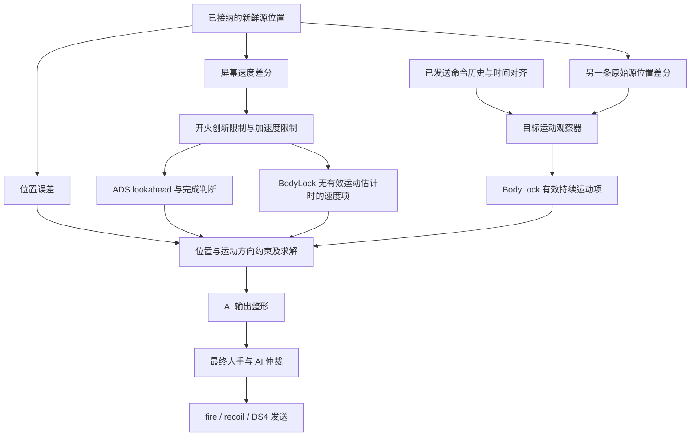

# 高频 Vision 下的响应门与状态滞后审查

审查快照：2026-09-26 17:30:47（香港时间），HEAD `e68f76eb5386866ab1ef8188af8718d9aa16db43` 加未提交改动。范围是 native gamepad 的 Vision → controller → DS4 路线。本轮只整理与核对，没有修改生产算法、配置或可执行文件。

**优先复查运动估计和输出整形的两次限速、开火速度证据限制，以及最终仲裁的 fresh 分支。** 它们能让新证据晚一些改变状态，或让已经改变的提案晚一些改变输出。但本轮不能证明这些门都是多余的，也没有把源码机制等同于某次实战卡顿的根因。

本文的“门”包括拒收、确认、状态保持、限速和执行权分支。按作用归成 32 项，不代表 32 个缺陷，也不代表它们在同一条路径上全部串联。每项列出被限制的量、解除条件和保留目的，便于以后按改动复查。

## 版本与历史：以前确实处理过

- 7 月 Refactor B（旧验收材料已删除） 已将生产链路收敛到一个目标计划和一个输出路径，移除了旧 completion/carry-brake、authority、短计划等独立阶段。历史文档曾接受部分跟踪误差换取稳定性；这不是今天允许牺牲索敌的依据，现行用户边界优先。
- [8 月 Direct 退役决定](../../.agent-context/decisions/DEC-2026-08-17-001-retire-direct-controller-experiment.md) 同时保留了两条经验：新鲜且有权限的目标应及时得到正确方向的响应；直接响应逐帧误差会放大噪声，不能重新引入已退役的生产路线。
- [8 月 18 日记录](../../.agent-context/archive/session-log-2026-08-03-to-2026-08-18-pre-20260901-compaction.md) 说明 BodyLock 运动观察器最初为持续移动跟不上而加入。冻结场景中的响应曾从 900 ms 内不能维持所需输出改善到 23 ms；三点中值、变化率限制和先退零也在那次设计中一起引入。这是历史特定场景结果，不是当前全部换向行为的验收。
- [9 月全链路 82 项清单](vision-controller-audit-20260926/INVENTORY.md) 仍可作机制索引；其中置信度、输出账本等描述已被后续工作区修改。本文保留旧编号作为对应关系，不直接沿用旧状态。

调查期间另一个任务正在试验候选，曾短暂出现新运动估计和 decay=80，随后回退。本快照的 observer 仍是三点中值 + rise8/decay20，shaper 仍为 rise64/decay48。高频区间累计和一版 BodyLock 源龄补偿则已在快照中；它们属于进行中的改动，不能据此声称已部署或验收。全部 50 个源码／配置快照及哈希见[证据清单](../../runs/controller_gate_audit_20260926/manifest.json)。

源码链接供定位当前工作区；具体判断和行号以审查目录的 `snapshot/` 同路径文件为准。收尾检查时 controller 的 cpp/h 已继续变化，本文不将后续候选混入这次快照。

## 先确认哪些限制真正串在一起

**Coordinator 的限速屏幕速度与 observer 的原始差分是两条证据路径。** 后者没有直接把前者再滤一次。有有效 observer 时，BodyLock 选择 observer 运动项；无效时才改用屏幕速度乘 .72。不能把所有速度限制的时间相加。ADS 完成判断仍消费 Coordinator 的速度，因此该分支被限速时，可能延后控制模式交接。

## 第一组：会保留旧方向、减弱纠正或造成帧间差异

以下“优先复查”表示有明确机制值得建立触发样例，不表示可以直接删除。

| ID／旧清单 | 门与被限制的量 | 触发、释放及保留理由 | 本轮判断／证据入口 |
|---|---|---|---|
| G01／E06 | observer 两样本启动、三点中值 | 至少两个合法区间建立运动估计；三点中值压制单帧几何尖峰。改变的是运动项，不阻止新位置进入计划 | 优先复查单帧噪声与真实速度阶跃的区别。[observer:77](../../native/controller_native/bodylock_target_motion_observer.cpp:77) |
| G02／E06 | observer rise8/decay20，每次反向先退零 | 每次合法观测最多变化 rate×区间时长。持有的旧估计逐步减小，再建立新方向 | 有确定的动态滞后。上轮组件测试在 200 Hz 的 +.4→−.4 完整变化为 80 ms；不能直接等同于最终输出延迟。[observer:158](../../native/controller_native/bodylock_target_motion_observer.cpp:158) |
| G03／U08 | shaper rise64/decay48、每 tick 最多 .08、反向先退零 | 已经算出的 AI 请求仍必须通过变化率包络；防止逐 tick 输出尖峰 | 与 G02 职责不同，但会在有效 observer 路线上叠加影响。上轮 +.8→−.8 在 1 kHz 下退零17 ms、完整换向30 ms。[shaper:103](../../native/controller_native/aim_dynamics_shaper.cpp:103) |
| G04／U09 | ADS→BodyLock、换目标与 cue 的专门整形 | ADS高旧值夹到新请求±.08，否则限步.07；换目标清AI状态；cue禁止同向增强 | 防止旧模式／旧身份的力泄漏。应查边界附近是否重复减速，不能把跨目标清零删掉。[shaper:58](../../native/controller_native/aim_dynamics_shaper.cpp:58) |
| G05／C09 | 开火速度创新限3.5 px，部分情况要求连续方向支持 | 最近开火上下文75 ms；ADS或低anchor且速度≤80的BodyLock支路，首帧沿用旧速度，未确认反向先把测量速度置零 | 优先复查。新位置仍接纳，但速度证据可能晚变；随后还经过 G06，所以“测量置零”不保证保存的速度立即归零。[coordinator:518](../../native/controller_native/target_coordinator.cpp:518) |
| G06／C10 | 屏幕速度变化≤3000 px/s²×dt，速度夹±4000 | BodyLock或开火ADS生效；持续证据逐步改变速度，限制几何噪声被放大 | 优先复查 ADS 制动／完成和 BodyLock fallback。单轴200 px/s的估计变化在该限幅下至少约66.7 ms，这是公式下限，不是实测端到端延迟。[coordinator:599](../../native/controller_native/target_coordinator.cpp:599) |
| G07／U05 | 位置与运动项的方向／近中心包络 | 持续运动与位置相反时按位置幅度渐弱；fallback速度受近中心包络限制；ADS lookahead可抵消位置但不能将请求穿零 | 这是空间限制，没有计时器，但可以削弱持续跟随或制动请求。快照已有ADS/fallback包络修改，须保护移动目标零误差时仍需非零输出的场景。[solver:67](../../native/controller_native/response_model_aim_solver.cpp:67) |
| G08／U12–14 | 最终仲裁的 material、旧Acquire手势、对向人工和 fresh 位置优先分支 | AI轴≤1e−4时走raw；持有旧Acquire反向手势时按activity保护人工；fresh且非cue、非D correction才额外提高位置权重 | 优先检查fresh/held周期差异。完整普通运行触发尚未证实；纯AI、D修正或前序手势分支可能让差异消失。shaper位于它之前，约束不了仲裁新制造的变化。[arbiter:151](../../native/controller_native/assist_control_state_machine.cpp:151)、[fresh分支:240](../../native/controller_native/assist_control_state_machine.cpp:240) |

G03 的内部状态代表连续 AI 提案，不是最终经仲裁／压枪／量化后的真实输出。当前主调用方没有逐 tick `adopt(final)`；这是理解状态的边界，不能直接加同步调用当修复，既有实验曾出现跟踪退化。

## 第二组：拒绝学习、等待证据或切换运动解释

| ID／旧清单 | 门与被限制的量 | 触发、释放及保留理由 | 本轮判断／证据入口 |
|---|---|---|---|
| G09／E02、E06 | 响应区间5–30 ms，observer区间4–40 ms；调用方统一至少累计5 ms | 新鲜同目标源帧才形成区间；短区间保留起点，达到门槛后才积分输出历史 | 高频无限拒收已有候选修复。当前共享调用门仍决定observer实际更新节奏：理想250 Hz流往往每2帧形成8 ms区间，320 Hz约6.25 ms；不会丢掉每帧的位置更新。[controller:783](../../native/controller_native/native_gamepad_controller.cpp:783) |
| G10／E02–03 | reliability≥.75、足够激励、人工／开火歧义排除 | raw右杆模长≥.35、开火及其后75 ms使响应样本不合格；相邻命令变化不足.04也不拟合R | 保护模型辨识，但可能长期使用旧R。observer仍可能更新，所以“R不学”不等于“不相信运动”。应配对检查两者证据政策。[eligibility:65](../../native/controller_native/aim_response_estimator.cpp:65)、[歧义标记:1318](../../native/controller_native/native_gamepad_controller.cpp:1318) |
| G11／E05 | ADS专用R的稳定证据与接管门 | 多anchor至少3个有效斜率、分布离散限制；累计≥8样本且confidence≥.35才替代通用R | 延迟模型适应，不阻止控制输出；本tick先选R再学习，新R通常下一tick才消费。[ADS estimator:105](../../native/controller_native/ads_response_estimator.cpp:105)、[接管:684](../../native/controller_native/native_gamepad_controller.cpp:684) |
| G12／E06、U04 | observer有效／无效切换与55 ms历史持有 | 同目标、已初始化、时间合法且年龄≤55 ms才有效；有效用持续运动权重1，无效转屏幕速度×.72 | 应检查启动、过期、重新有效时的运动项连续性。55 ms是最长可用年龄，不是固定等待55 ms；外层源龄50 ms也会先撤掉目标权限。[estimate:98](../../native/controller_native/bodylock_target_motion_observer.cpp:98)、[消费:24](../../native/controller_native/bodylock_follow_controller.cpp:24) |
| G13／E08 | 开火cue下仅保留合格的横移历史 | 左X≥.15、输入变化≤.12，同目标／代／ADS epoch、非开火快照≤55 ms，且水平运动向误差外侧；Y清零 | 这是严格受限的连续性桥接。失格会停用该运动补偿，不等于直接停掉整个BodyLock；不能拿普通移动测试证明此分支无退化。[controller:915](../../native/controller_native/native_gamepad_controller.cpp:915) |
| G14／E01，新候选 | 已发送命令窗口与源龄补偿资格 | 无可覆盖区间、发送失败或重连会打断账本；候选仅在有效observer、Observed生命周期和合法窗口时补偿源龄 | 信任边界应保留。9 ms用于对齐历史，未sleep；补偿不满足条件时回到源位置求解。本项仍在另一个任务迭代。[补偿:1033](../../native/controller_native/native_gamepad_controller.cpp:1033)、[回执:1359](../../native/controller_native/native_gamepad_controller.cpp:1359) |

G10 中估计器声明的“目标加速度≤800”也不能当成本路线真实拒收门：主调用方当前传入的是0。G11的置信度累计、G12的有效性与G01的两样本启动是不同条件，不能把它们都简称为“等两帧”。

## 第三组：目标与人手权限的确认门

这些条件主要保护“是否可以控制这个目标”。优化响应时必须证明事件和身份一致，不能只因它们存在时间／帧数就删除。

| ID／旧清单 | 门与被限制的量 | 触发、释放及保留理由 | 本轮判断／证据入口 |
|---|---|---|---|
| G15／I04 | LT激活与ready迟滞 | >5%可唤醒视觉；≤3%连续3输入样本释放；默认30%才ADS ready，下降到25%以下撤ready | 防止扳机边缘抖动；不是右杆死区或每次目标反向都要等待。[input edge:53](../../native/controller_native/input_edge_reducer.h:53) |
| G16／V08–15 | selector几何／置信度资格、两帧初选确认、有效身份保留 | 一般同一候选连续2次才初选，足够可信的敌标候选可单帧；普通排名改变不能强行替换有效身份 | 第一个合法候选之后通常再等一个视觉间隔，候选变化可重置。不是持续跟踪每帧都重新等2帧。[selector:1712](../../native/vision_native/src/target_selector.cpp:1712) |
| G17／V07、C02 | epoch、源时间／帧顺序、50 ms源龄与身份代校验 | RuntimeDeliveryGate先接纳合法发布，Coordinator再保护自己的身份／生命周期 | 两层拥有不同边界。无测量不能宣称它们有固定额外一帧延迟。[delivery:70](../../native/runtime_app/vision_service.cpp:70)、[coordinator:255](../../native/controller_native/target_coordinator.cpp:255) |
| G18／C04 | 无发布保持，新鲜空帧／超龄撤权 | 无新发布保持上次源点与权限；新鲜空帧或源龄>50 ms撤力；未完成ADS的同代miss可暂保身份，期间不驱动 | 与“一下动一下停”最相关的事件分界。应先检查停顿时是无更新还是有效空帧，不能混为漏帧。[coordinator:670](../../native/controller_native/target_coordinator.cpp:670) |
| G19／C01 | BodyLock重按LT后的新帧判定 | 先等重按后的合法新帧，再看目标是否在BodyLock范围外；无合格候选最多等8个新帧 | 保护一LT一次snap与重新索敌意图；范围内继续BodyLock。不是每次初次ADS都先等8帧。[reacquire:86](../../native/controller_native/ads_reacquisition_reducer.cpp:86) |
| G20／C03 | 尚未接纳目标的ADS等待预算220 ms | 有合格目标即可接纳；直到预算耗尽仍无目标才结束等待 | 220 ms是等待上限，不是找到目标后必须再等待220 ms。[coordinator:229](../../native/controller_native/target_coordinator.cpp:229) |
| G21／C11–12 | ADS完成连续3新帧与时间阶段 | 半径8、预测20 ms、closing≤320，持续满足才交给BodyLock；严格近中心穿越可更早完成。135 ms后进入extension，再过220 ms进入manual-safe | 可能延迟控制律交接，但期间仍有ADS输出。355 ms也不是强制结束AI的总寿命。[coordinator:853](../../native/controller_native/target_coordinator.cpp:853) |
| G22／C07、U10 | D边界退出与HandoverSeek | 人手推动D到边界后持续至少50 ms才明确退出；进入Seek后不再恢复旧目标，直到新身份或scope释放 | 保护显式退出及跨目标权限；人工输出保持。不能给Seek增加超时回旧目标来掩盖索敌问题。[D:209](../../native/controller_native/target_state_reducers.cpp:209)、[Seek:135](../../native/controller_native/assist_control_state_machine.h:135) |
| G23／U10 | 明确交接后的Capture状态 | Seek发现新身份后进入；2个满足半径的新帧或默认135 ms超时退出。普通初选／替换直接Track；Capture中也调用同一cooperative_output | 源码不支持“普通索敌又被额外阻塞2帧”的说法。当前Capture与Track的输出求解基本相同，是否还承担必要语义可单独整理；状态名不是延迟证据。[arbiter state:135](../../native/controller_native/assist_control_state_machine.h:135) |
| G24／C13–15、U07 | 距离、reliability、cue与椭圆输出预算 | 超出BodyLock尺寸扩展范围撤aim权限；有效目标仍按证据缩放与限幅，cue有额外限制 | 会让输出小或为零，但主要是权限／幅度约束。`visual_authority=false`只关闭部分无cue系数，没有关闭全部证据缩放。[coordinator:990](../../native/controller_native/target_coordinator.cpp:990)、[BodyLock:35](../../native/controller_native/bodylock_follow_controller.cpp:35) |

当前15–30%人手权重是每tick直接计算的幅度曲线，没有时间累计；raw透传保持零软件死区。它影响“是否把输入解释成人手意图”，仍应与 G22 的50 ms边界退出分开理解。

## 第四组：真正的等待与其他容易混淆的时序

| ID／旧清单 | 门与被限制的量 | 触发、释放及保留理由 | 本轮判断／证据入口 |
|---|---|---|---|
| G25／I09 | controller绝对期限调度 | 配置1 kHz；run_once完成后sleep／wait到下一个期限 | 真实线程等待，但不是几十ms的算法反应计时器。实际超时和抖动要测，不能用配置证明达到1 kHz。[runtime:580](../../native/runtime_app/runtime_loop.cpp:580) |
| G26／V01–02 | Vision限频、worker条件等待与邮箱互斥锁 | 配置active200／idle60 Hz；worker不到期限不poll；controller的set_aiming、set_user_aim_intent、latest_snapshot都取同一mutex | controller可能短暂等锁；poll_once在锁外，controller并不持锁等完整GPU推理。锁内有快照复制／发布，未测争用时长。[service:195](../../native/runtime_app/vision_service.cpp:195)、[poll:215](../../native/runtime_app/vision_service.cpp:215) |
| G27／S05 | 同步Vision备用路线 | 只有没有VisionService时，controller线程直接poll_once | 该路线会把捕获／推理等待带入tick；快照配置gpu_service_enabled=true，正常主路线未走它。[runtime:748](../../native/runtime_app/runtime_loop.cpp:748) |
| G28／I01、U21 | SDL读取、ViGEm发送与设备重连 | 外部调用在当前tick执行；失联时同步尝试重连，重试节流限制下一次尝试时刻 | 存在I/O耗时边界，未发现项目在正常发送路径人为sleep几十ms。重试节流不是睡眠；实战耗时未测。[SDL:404](../../native/controller_native/sdl_gamepad_reader.cpp:404)、[ViGEm:202](../../native/controller_native/virtual_gamepad.cpp:202) |
| G29／U15 | AutoFire readiness两帧 | 新鲜可开火目标、误差≤16 px、AI residual≤6000/32767；足够人工跟随可豁免residual检查；累计不同vision sequence | 限制自动开火，不能当右杆启动等待。代码中ads_min_elapsed由主调用方传true，不能据字段名推断另有ADS延时。[fire:141](../../native/controller_native/auto_fire_gate.cpp:141) |
| G30／U16 | AutoFire脉冲和人工接管保护 | pulse30/100 ms，人工接管35+85 ms保护 | 属于fire时序。会通过最近开火上下文间接影响 G05/G10，需联合检查，但不直接冻结右杆。[fire:35](../../native/controller_native/auto_fire_gate.cpp:35) |
| G31／U02、U04 | ADS135→90 ms、BodyLock45/60 ms到达时间尺度 | 求解器用误差除以时间尺度与响应比例；每tick仍求解 | 是控制增益／收敛速度参数，没有等到时间结束才输出。不能将45/60 ms加到流水线处理耗时。[BodyLock:42](../../native/controller_native/bodylock_follow_controller.cpp:42) |
| G32／V01、D07–08 | 1000 ms视觉保温、mouse专用ramp与退休旋钮 | 保温只延长Vision高频运行；mouse专用1 ms加减速不用于本gamepad路径；ai_proposal_*保持未知／无效 | 从本轮gamepad延迟嫌疑中排除。禁止把恢复异步AI提案当成清理门控的办法。[配置](../../config.toml:35)、[构造映射](../../native/controller_native/native_gamepad_controller.cpp:178) |

## 本轮优先级与验证缺口

第一优先是 **G01–03、G05–09**，按实际经过的分支检查；第二优先是学习长期不更新、observer有效性切换和cue桥接（G10–14）。G15–24以保护现有产品契约为前提核查等待来源。G25–28需要时序证据才能判断是否有线程阻塞问题，静态审查不能给出其P95或实战贡献。

已有 [shaper测试](../../native/controller_native/aim_dynamics_shaper_tests.cpp:36) 明确要求“先退零再反向”；这说明它是设计约束，并非一段无人知道的偶然代码。已有 [BodyLock方向冲突测试](../../native/controller_native/bodylock_follow_controller_tests.cpp:77) 保护运动项不能随意反转位置轴。但这些局部契约并不自动证明组合后的停止时延、跟随连续性与抗噪都符合当前目标。本轮只查阅测试，没有重跑产品矩阵或宣称已有测试通过。

后续每次修改相关门，至少成对保留：持续匀速／速度阶跃、静止噪声／真实停止、无新发布／新鲜空帧、fresh／held、人工中立／反向手势、开火／停火、同身份／换身份。诊断应分别记录原始位置、两条速度路径、运动项是否有效、requested AI、shaped AI和最终发送值，才能定位最早发生“新证据未生效”的拥有者。

上轮14个组件案例结果可从[延迟调查目录](../../runs/controller_latency_investigation_20260926/result.json)复核；本轮仅在相关组件源码哈希一致时引用其中的17/30/80 ms。完整controller已变化，因此这些数值不能充当本快照全链路回归结果。快照、引用校验和变化检查结果存于[审查目录](../../runs/controller_gate_audit_20260926)。

以后定期整理时，可以在响应、运动估计、仲裁或生命周期修改后按 G 编号增量复查，记录该门改变的量、进入／解除条件、现有回归与新的反例，避免每次只数if或重新从头解释全部82项。建议后续把本文链接和快照时间加入 `.agent-context/`，本轮未修改上下文文件。
