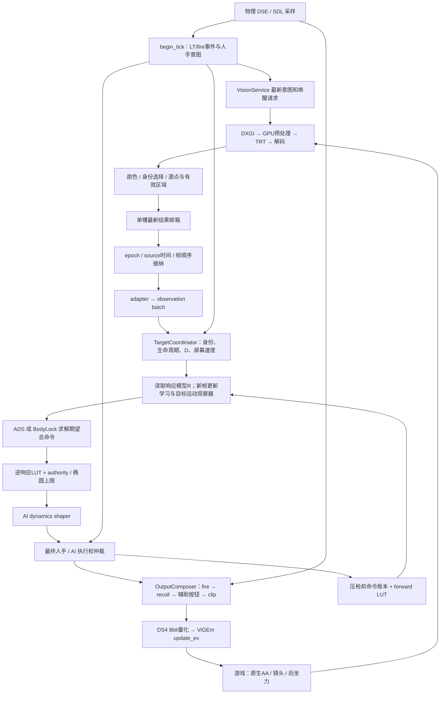

# 从画面到 DS4：整条控制链如何改变输出，以及过冲风险在哪里

2026-09-26 · native gamepad 路线源码审查 · 按 tech-art 整理

## 判断先行

这套程序已经是一个多阶段、带在线学习和离散生命周期的闭环控制系统。视觉决定身份和几何，人手既能修改目标点又能争取执行权；ADS、BodyLock 用不同的到达时间和运动补偿生成命令，再经过非线性响应曲线、限速、仲裁、压枪和 DS4 量化。**仅把 25% 判断门改平滑，或者换一条 DS4 启动曲线，都不能覆盖这条链路的主要风险。**

本次从入口和消费者重新追踪，未以旧日志结论代替源码判断。发现的重点是：排序分数进入控制可靠度、屏幕运动与目标运动在不同分支使用不同解释、执行器账本没有记录真正发送的最终命令，以及多个“力度”参数同时改变闭环增益与输出上限。这些有明确源码依据；其中哪些占据实战过冲的主要比例，仍需要按因果关系区分，不能从存在某个分支直接推出它就是现场根因。

完整机制、数值、当前是否生效和源码入口见 [输出影响清单](D:/work/AI/yolo-study-001/docs/research/vision-controller-audit-20260926/INVENTORY.md)。清单覆盖输入/时序、视觉、身份/几何、生命周期、学习、求解、仲裁、fire/recoil和DS4出口，并单列停用或仅诊断的路径。它按语义归组，不把每个 `if` 当成一个独立算法缺陷。

## 审查对象与证据边界

审查基于工作区 HEAD `e68f76eb5386866ab1ef8188af8718d9aa16db43` 及当前未提交文件。工作区保留上一轮的 **15–30% 人手权重候选**；它未部署，本轮没有继续修改生产算法、重建运行程序或重新跑大型优化矩阵。

对现有 `cod_native_runtime.exe --config config.toml --dump-effective-config` 的只读检查显示，程序构建标记仍是 `e30e75765c117d627277062bdc042f258a05c81e`，SHA-256 为 `2d6c268a26b33ac3cd587ab4f0ecbfa84925676f926ac37715160dbf445396a0`。该命令在构造 RuntimeLoop 和创建虚拟手柄之前返回。它证明的是“这个可执行文件加载当前配置”的结果，不能反推某次历史会话的全部配置，也不能证明工作区候选已在游戏里运行。

当前配置：640×512捕获、480×384推理、Vision active 200 Hz、controller 1000 Hz、DS4输出；legacy COD Dynamic LUT、响应先验650、响应对齐假设9 ms；ADS135 ms；BodyLock力度X=.8/Y=.6、tolerance=8；额外无敌标authority衰减关闭；固定recoil=.20启用。配置快照、源码哈希和探针结果归档在 [审查证据目录](D:/work/AI/yolo-study-001/docs/research/vision-controller-audit-20260926)。dump没有打印所有隐藏默认值，本文用构造器和头文件补齐，未将未打印字段误判为未启用。

本次没有重新校准游戏内响应，也没有把 TensorRT engine 内部后处理、SDL/USB驱动、ViGEm驱动或游戏AA实现当成已经审完的项目源码。它们是明确的外部边界。

## 真实调用链：视觉是异步的，控制和输出仍同 tick 执行



这里有三个不同的时钟：物理/控制采样、视觉源帧、游戏实际执行。1000 Hz 循环不代表每毫秒获得一次新目标位置。通常一个视觉源点会被多个控制 tick 重用；没有新发布时 controller 不外推源点，遇到新鲜空帧则撤销输出权限，最大源龄50 ms。Vision松开后保温1000 ms只维持工作频率，不保留辅助权限。

单个 tick 的关键顺序是：先采样人手→取已完成的视觉结果→构造计划→选本 tick 使用的R→按新观察更新学习→求解→限速→仲裁→生成fire/recoil→组合→记录最终浮点输出→发送DS4。**本 tick 新学到的响应通常从下一 tick 使用。** 输出后才做的Fusion、telemetry和viewport工作，也可能占用下一次采样前的时间，但不能解释为本 tick 又加了一次AI滤波。[运行循环](D:/work/AI/yolo-study-001/native/runtime_app/runtime_loop.cpp:643)、[控制器顺序](D:/work/AI/yolo-study-001/native/controller_native/native_gamepad_controller.cpp:591)。

## 先把几种容易混淆的量分开

程序中的 source point 是视觉从人物框算出的点；R 是允许瞄准的区域；D 是当前真正追随的期望点，可以由人手在R内移动。当前站姿源点约为人物高度35%，宽低姿态为65%。D还可能在接纳时向上缩短一小段行程，并在后续框变形时按区域内归一化位置移动。因此画面上的“同一个目标”并不保证每帧纠错目标点完全稳定。

屏幕误差速度包含目标运动、玩家自身平移、镜头转动、开火扰动和检测几何变化。Coordinator保存一条经过开火创新/加速度限制的屏幕速度；响应学习另用未经这些限制的源点差分；BodyLock观察器再扣除模型认为的镜头运动，得到“让目标静止所需的总运动命令”。这三条路径不是同一种速度，不能在日志上都简称为 target velocity。

AI求解器产出的是期望总命令T，最终仲裁并非处处把M和T相加。同向通常补足到T或保留更强人手；反向、ADS阶段、D修正、向下压枪、斜向耦合则有不同规则。另一方面，人手又通过 `M*w` 改D，所以“执行权只仲裁一次”不等于人手只影响系统一次。

## 优先问题一：排序 bonus 穿过了接口，变成执行可靠度

视觉中 `color_bonus=10000` 的量纲是选目标的排名分数。adapter却计算 `confidence=clamp(detector.conf+color_bonus,0,1)`，随后 controller 把它直接用作reliability。于是同样检测置信度 .65 的目标，有敌色时可靠度成为1，失去该色标时可能回到 .65。

这会产生三条实际传播路径：BodyLock位置/运动命令的authority改变；映射后的允许力度预算改变；响应学习是否跨过 `.75` 可靠度门改变。最终反向仲裁还用 `(visual_authority-.65)/.35` 定义证据权重。一个视觉标记的出现/消失因此可能同时改变跟随力度、模型学习和人手冲突规则。当前 `visual_authority_enabled=false` 只跳过额外无cue系数，并没有截断这条路径。

**判定：接口语义混用已确认；它是否是某次摆动的触发器，需要对应色标/可靠度变化序列。** 修复责任在视觉到控制的adapter数据契约：把 `selection_score`、`detector_confidence`、`enemy_evidence`、控制证据明确分开。不能先删除敌方优先级，或直接把所有可靠度都置1；那会改索敌和误目标保护。[颜色bonus](D:/work/AI/yolo-study-001/native/vision_native/src/target_selector.cpp:792)、[adapter](D:/work/AI/yolo-study-001/native/runtime_app/vision_controller_adapter.cpp:85)、[authority消费者](D:/work/AI/yolo-study-001/native/controller_native/target_coordinator.cpp:1002)。

## 优先问题二：模型误差能被重新解释成目标运动，再通过前馈输出

BodyLock观察器在X轴上计算：

```text
估计目标运动（normalized command） = 对齐后的平均命令 + 屏幕速度 / 估计R
```

理想情况下，静止目标的屏幕运动由镜头解释，结果接近0。可是一旦R或者对齐时延不正确，剩余误差就进入目标运动。源码随后把这个估计按“持续目标运动”权重1交给BodyLock；没有有效估计时，才使用另一套屏幕速度×.72规则。观察器的confidence会被记录，但没有作为这两种解释之间的连续混合权重。

直接调用当前C++的小探针使用静止目标的合成观测：真实R=918.611084、命令=.5、屏幕速度=-459.305542px/s，而模型R=650。两次合法观察后，观察器得到 **-.206624 的虚假目标运动**，相当于-134.306px/s。这不是实战测量，数值仅用于暴露公式的依赖。若同一状态随后按R=918.611084解释，会变成-189.807px/s，因为观察器保存的是旧normalized状态，消费处乘的是当前R。

更需要注意的是，响应学习在开火及之后75 ms会拒绝样本；BodyLock运动观察器没有接受同一份fire ambiguity信息，仍可处理该窗口中的屏幕运动。响应模型暂时不学，运动前馈却可能继续相信“扣除镜头以后剩下的都是目标运动”。固定recoil和游戏原生后坐力都使这个假设更弱。

**判定：这是最应优先收敛的算法结构风险；不能靠多加一个符号门掩盖。** 应先明确运动估计的物理单位、对应的源时间和实际执行命令，再统一其不确定性。响应R、时延、目标运动和射击扰动不能分别用自己的简化假设拼成一个“确定值”。单独重标状态也不足以证明闭环改善，仍须保护运动目标跟随能力。[观察器](D:/work/AI/yolo-study-001/native/controller_native/bodylock_target_motion_observer.cpp:56)、[学习与观察器调用](D:/work/AI/yolo-study-001/native/controller_native/native_gamepad_controller.cpp:827)、[状态消费](D:/work/AI/yolo-study-001/native/controller_native/native_gamepad_controller.cpp:989)。

## 优先问题三：学习所依据的“已执行命令”不等于出口命令

`record_aim_response_command` 在组合压枪之前执行，输入是仲裁后的pre-recoil stick，经forward LUT后存入账本；时间取控制决策时刻。之后OutputComposer才加固定压枪、限幅，DS4再量化，ViGEm最后才返回是否发送成功。`observe_composed_output` 只更新诊断，没有修正这个账本；关闭输出或发送失败也不自动让该账本失效。

开火拒绝学习能减少部分污染，但并未解决BodyLock运动观察器继续使用该账本的问题。还要区分三个事实：计划发送、驱动接受、游戏实际消费。即使ViGEm成功，固定9 ms也只是从命令到可见响应的模型假设，不是实测回执。

**判定：命令证据的归属边界存在缺口。** 建议唯一输出出口产生一份执行记录：quantized/dequantized DS4 stick、recoil贡献、发送前后时间、driver accepted、身份/epoch；模型使用它做区间积分。无需新增事件总线或排队延迟。计划值保留做诊断，游戏消费时延保持“估计”身份。这一改动先验证单位与时序一致性，再讨论增益优化。[账本写入](D:/work/AI/yolo-study-001/native/controller_native/native_gamepad_controller.cpp:1290)、[组合顺序](D:/work/AI/yolo-study-001/native/controller_native/output_composer.cpp:193)、[发送顺序](D:/work/AI/yolo-study-001/native/runtime_app/runtime_loop.cpp:799)。

## 优先问题四：几处隐含提速和阻尼串联，参数名字不能解释实际力度

直接调用现有C++求解器和整形器的探针结果如下。增益比在关闭LUT、无运动项、未触及饱和的小误差下测量，用于隔离公式；生产LUT/authority/包络会继续改变最终stick，不能把比例机械乘到所有实战样本。

| 机制 | 已核实数值 | 对链路的意义 |
|---|---:|---|
| ADS大目标加速 | H135→90ms，位置增益最大×1.5 | 距离/人物尺寸本身改变到达速度 |
| ADS目标在上方 | Y horizon×.84，位置增益×1.190476 | 不是上下对称的控制律 |
| BodyLock当前时间尺度 | X45ms、Y60ms | ADS完成后切入的跟随律并不天然更“软” |
| BodyLock strength .4→.8 | 小误差位置增益×2 | 该设置同时变更响应速度和上限 |
| ADS纵向上限配置 .9 vs 1 | 当前authority budget下输出差为0 | 两者先×√2再被budget1截断，配置并未产生预期10%差异 |
| shaper从+.8要求反向 | 第1ms仍+.752，第17tick才到0 | 平滑保存旧方向；其后才升起反向力 |
| 同一旧运动状态随R改变 | -134.306→-189.807px/s | 状态单位依赖可变响应模型 |

BodyLock的计算是 `H=feedback_range/(max_force*fallback_R)`，当前feedback_range由 `max(18,tolerance*1.5)` 得到18，fallback_R=500；求解时再除以学习R。**因此`tolerance=8`并不表示8px内不动，strength也不是纯粹的“最大力度”。** 同一组参数把误差纠正速度、学习响应和饱和联系在一起，盲调一个值很难判断改善来自哪里。

ADS还有一个相反的参数陷阱：当前纵向strength=.9先乘√2成为约1.273，再与authority budget=1取较小值，实际椭圆Y上限仍为1；配置为1也同样得到1。也就是说，不能据配置表中的“.9”判断纵向已经减少10%输出。应让公开参数对应清晰、可测的控制作用。

此外，Coordinator的速度限制、运动观察器的中值与8/20每秒限速、solver近中心运动约束、AI输出64/48每秒限速、最终人手仲裁，是依次执行的不同机制。它们并不交换顺序；前一层已经削弱刹车，后一层仍可能保持旧输出。shaper的内部状态也没有跟随最终仲裁实际采用的stick重置，因此它表示“AI自身的连续提案”，不能被当成真实执行器状态。

**判定：这些机制确实改变动态，但不能一律删除。** 应把位置响应时间、运动估计、执行器可实现限制和人手权限分开命名、分开验证；用一个明确的到达/制动模型替代按模式和朝向补偿的零散增益。退出/失权仍立即归还raw，不给整条final输出统一加平滑来掩盖问题。[ADS](D:/work/AI/yolo-study-001/native/controller_native/ads_acquisition_controller.cpp:37)、[BodyLock](D:/work/AI/yolo-study-001/native/controller_native/bodylock_follow_controller.cpp:48)、[shaper](D:/work/AI/yolo-study-001/native/controller_native/aim_dynamics_shaper.cpp:133)。

## 还需要纳入重构判断的接口与离散变化

**姿态切换会改变被追随的点。** `H/W<.65`将源点从.35H改为.65H。若两帧框在该阈值附近波动而仍保留同一身份，源点的垂直变化就进入速度计算。这里应先有保持身份、仅扰动box长宽比的反例，再决定连续几何规则；直接增加等待帧会影响索敌。

**15–30%曲线没有消除全部执行条件。** 它在每轴幅度上渐增人手权重，但onset/reversal目的、D边界、ADS阶段、AI是否有material输出、同向/反向、开火向下等依然改变分支。下游selector还有解释信号强度.05的门，学习还有raw .35的排除，AutoFire有.08的人工跟踪条件。这些不是原始转写死区，却不能在解释系统时统称为“只剩一个25%/15–30%判断”。

**fresh位置优先分支需要做可达性确认。** 单独给最终arbiter相同M=-.225、AI=.6、误差8，只切fresh标志，探针输出可从.6变为.226875；加上正常D correction标志后，两者都为.226875。它证明该函数有帧事件相关的输出规则，**未证明普通运行一定能走到这个组合**；持有的acquire手势也有更早的保护分支。应先用完整controller状态转移触发，再决定删除或归并，不能据局部探针把它宣布为现场根因。[仲裁分支](D:/work/AI/yolo-study-001/native/controller_native/assist_control_state_machine.cpp:245)。

**DS4协议本身没有选择响应曲线。** 项目出口对轴做线性8bit量化，逆LUT发生在上游AI求解中，当前仍是 `cod_dynamic_legacy_lut`。换虚拟设备可能改变游戏看到的设备类型与响应，但本代码没有因此自动得到一条“适合DS4的实测曲线”。当前触摸坐标供本地宏使用，不透传成虚拟DS4触点；触摸按压则透传，gyro置零。原生右杆0死区依然成立，量化不可等同于额外软件死区。[协议转换](D:/work/AI/yolo-study-001/native/controller_native/ds4_output_report.h:21)。

**有些可疑名字并不参与当前算法。** operation classification是在仲裁后只填日志；ads/bodylock demand并不驱动solver；bodylock_exit_radius有赋值但无实际消费；`.20–.40`弱关联路径被生产TRT的`.40`解码下限挡在上游；当前recoil只是固定-.20，不是配置长列表暗示的枪械识别曲线。清理这些误导有价值，但不能把它们算成已移除的过冲原因。

## 建议的重构顺序：先统一事实，再减少控制规则

目标是保留索敌能力、原始0死区、明确的人手退出权与fire边界，同时减少彼此修补的控制分支。现有身份/epoch/source时效门具有不同边界责任，应保留；优先合并的是同一个物理量在不同组件中被重复解释、重复增减力度的部分。

| 顺序 | 具体改动 | 为什么放在这里 | 通过条件 |
|---|---|---|---|
| 1 | 拆开选择分数、检测置信度、敌我证据和控制可靠度；补齐raw/source/D/命令字段的单位与拥有者 | 先阻止跨接口的隐式增益；保留selector排名和身份行为 | 同帧候选选择/身份一致；颜色切换只改变设计允许的证据；无误敌/漏敌回退 |
| 2 | 在唯一DS4出口形成实际发送记录，模型按capture区间消费；区分计划/driver accepted/估计生效 | 让后续模型修正建立在真正执行的命令上 | recoil、量化、clip、发送失败、停用输出的区间记录准确；不新增执行等待 |
| 3 | 统一响应、运动、fire扰动的时间和物理单位；消除旧normalized状态被新R任意重解释 | 降低“模型误差→虚假目标运动→前馈”反馈 | 静止/移动/加速度/AA变化/开火/延迟抖动成对验证；不能靠关掉运动项换取静止稳定 |
| 4 | 用显式到达时间与制动需求代替隐含CQB/朝向增益；strength仅表达清楚的一种约束；评估单一执行整形策略 | 数学模型应解释需要多快、何时制动，减少特殊方向补偿 | 索敌时延、有效目标机会、过冲、收敛和方向反转同时保护；raw退出即时 |
| 5 | 审核并归并最终仲裁、D修正、模式交接的离散规则；清理失效配置和诊断命名 | 在状态含义稳定后，才能判断哪些门真重复 | 对每个删除分支有触发样例和相邻反例；非fresh重用不制造无依据的权限变化 |

这些是本次审查得出的重构方案，**尚未实现或声称验证有效**。尤其不能将第3步简化成“统一把650调大”，也不能将第4步简化成“全部力度降低”；两者都可能牺牲索敌，且掩盖命令/速度证据不一致。

## 用较短的验证循环检验结构，而不是每次都跑长矩阵

本次仅运行了隔离的源码行为探针，直接编译现有solver、observer、shaper和arbiter，约3.4秒完成编译。探针不是游戏仿真，也不经过Vision识别和完整生命周期；其结果只支撑文中的局部公式和状态行为。源文件与结果见 [probe.cpp](D:/work/AI/yolo-study-001/docs/research/vision-controller-audit-20260926/probe.cpp)、[probe-result.json](D:/work/AI/yolo-study-001/docs/research/vision-controller-audit-20260926/probe-result.json)。

后续按三层执行：先用几何/身份、输出账本、状态单位和单tick权限的快速原生测试筛掉错误设计；再跑冻结种子、匹配基线的完整controller闭环短矩阵；只有前两层通过，才跑大量长短随机案例和留出种子。每个修改先保留RED触发与匹配反例，统一检查索敌、身份、ADS、BodyLock、人手权、AutoFire、recoil和输出安全，不以总分提高交换局部退化。

仿真还必须避免一个盲点：如果游戏plant和controller使用同一条LUT、同一个时延和同一套AA假设，它们会相互证明正确。应独立变化真实plant响应、AA慢区大小与滞后、横纵轴差异、DS4量化、画面源龄和目标运动；日志推导的参数要标为推断。离线通过后，仍以匹配的native/live A/B和手感确认作为生产验收。

本次交付完成的是整条可见项目调用链的机制清单、已确认的局部行为、风险排序和重构职责。没有将旧候选包装成这次全链路审查的解决方案，也没有把“发现某个限制”当作删除它的充分理由。
