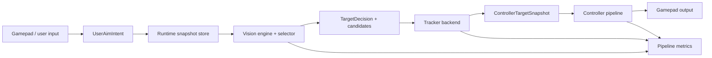

# Vision -> Controller Protocol Refactor Report

Date: 2026-07-01

Status: review and planning only. No implementation changes in this document.

## Goal

Build a cleaner native pipeline for vision, tracker, and controller communication while reducing the size and responsibility load of `NativeGamepadController`.

The target design is not just "pass more data from vision to controller". The target is a typed runtime-owned context where:

- vision can use user intent as soft selection evidence;
- controller consumes a stable target snapshot, not raw vision internals;
- tracker remains a target-state service, not a controller extension;
- logs and benchmarks can explain why a target was selected, switched, held, rejected, or corrected.

## Current Code Findings

### 1. Boundary Coupling Is Already Reversed

`tracking_native` currently depends back on `controller_native` through tracker config and tracker types. At the same time, `controller_native` depends on tracking. This makes it hard to introduce a shared communication layer without creating more cycles.

Observed areas:

- `native/tracking_native/tracker_backend.h` includes controller tracker types.
- `native/controller_native/runtime_config.h` includes tracking backend types.
- `native/controller_native/native_gamepad_controller.h` exposes `submit_vision_result(const vision_native::VisionResult&)`.

Impact:

- controller cannot be cleanly tested as a controller-only consumer;
- tracker cannot become a neutral service;
- any shared context added now would likely inherit these dependency mistakes.

### 2. `VisionResult` Is Doing Too Much

`native/vision_native/include/vision_native/types.h` currently mixes final target fields, raw detections, external cue, authority, and timing metrics into one object.

This object is useful for compatibility, but it is not a clean protocol. It leaks vision internals into controller and makes it unclear which fields are:

- target decision;
- raw candidate evidence;
- debug metrics;
- fire authority;
- continuation/cue state;
- tracker assist information.

Impact:

- multi-target intent selection is hard to reason about;
- controller has to defend itself against unauthorized or weak vision data;
- logs can show the final target but not enough about candidate selection.

### 3. `NativeGamepadController` Has Become a Pipeline Container

`native/controller_native/native_gamepad_controller.cpp` and `.h` now own too many responsibilities:

- vision result ingestion and conversion;
- tracker observation construction;
- target credibility gating and projection fallback;
- ADS state and FOV scaling behavior;
- manual input mixing and takeover handling;
- bodylock short planning;
- wrong-way / output validation;
- auto-fire state;
- recoil final-stage application;
- benchmark and trace output fields.

This is why small behavior fixes keep touching the same central class. It is also why it is difficult to make vision/controller communication cleaner without risking feel regressions.

### 4. `VisionTargetSelector` Is Also Becoming a Decision Monolith

`native/vision_native/src/target_selector.cpp` is large and combines candidate scoring, active target retention, switch confirmation, cue hold, ROI/color requirements, and authority rules.

That is acceptable for the current stage, but it means intent-aware multi-target work must be added carefully. User intent should be introduced as one scoring signal with explicit logs, not as another implicit override path.

### 5. Tests Are Strong but Poorly Shaped for This Refactor

Current controller tests cover many important behaviors: authority/fire gates, no-update target retention, unauthorized detection rejection, wrong-way correction, suspicious jump hold, ADS FOV scaling, and recoil isolation.

Main gaps:

- `controller_behavior_tests.cpp` is a very large single test file.
- `cod_native_controller_tests` does not make `VisionTargetSelector` a first-class native unit contract.
- benchmark scenarios often construct `NativeControllerVisionState` directly, so they test controller feel but not the full selector protocol.
- benchmark smoke is not yet phase-specific enough for selector intent and ROI fallback work.

## Target Architecture

### Ownership Model

The runtime app should own the hot-path snapshot store. Vision, tracker, and controller should not own a shared global object and should not include each other's implementation headers.

Recommended neutral module:

- `native/pipeline_contract/`

Allowed dependencies:

- `pipeline_contract` depends only on common scalar/time/math types.
- `vision_native` may include `pipeline_contract`.
- `tracking_native` may include `pipeline_contract`.
- `controller_native` may include `pipeline_contract`.
- `runtime_app` composes all modules and owns snapshot exchange.

Forbidden direction:

- `vision_native` must not include `controller_native`.
- `controller_native` must not include `vision_native` as its long-term public protocol.
- `tracking_native` must not include `controller_native`.
- hot-path target exchange should not reuse `shared_fusion`; that is an overlay/IPC ABI concern, not the in-process control contract.

### Core Types

Phase 1 should introduce small typed contracts without changing behavior.

Suggested types:

- `UserAimIntent`
  - source, timestamp, sequence id, strength, direction, optional point, aiming/ADS state.
  - no fire authority, no raw detection access.

- `VisionCandidateSnapshot`
  - candidate id, source, bbox, aim point, confidence, color/cue status, reject reason, score fields.
  - for selector/logging/benchmark visibility.

- `TargetDecision`
  - selected candidate id, previous id, transition reason, authority, tier, score breakdown, intent applied/ignored reason.
  - produced by vision selector.

- `ControllerTargetSnapshot`
  - the compact controller-facing state: target point, confidence, authority, age, velocity/projection fields, selected id.
  - no raw vision timing, no detector internals.

- `VisionSearchPlan`
  - optional ROI/search hints for later optimization: regions, reason, source intent id, fallback mode.

### Intended Flow



Important rule: user intent can help vision choose between plausible targets, but it must not grant fire authority by itself.

## Strict Refactor Plan

### Phase 0: Baseline Freeze

Purpose: create a reliable comparison point before structural movement.

Tasks:

- Run current controller tests and benchmark self-test.
- Record a small named benchmark baseline for ADS/manual/overshoot and current multi-target-like synthetic cases.
- Record current forbidden-coupling state as known debt.
- Do not tune behavior in this phase.

Acceptance:

- current tests pass;
- benchmark JSON baseline is saved under a deliberate baseline name;
- no production behavior changes.

### Phase 1: Protocol Extraction Without Behavior Change

Purpose: create the clean communication surface while keeping old runtime behavior.

Tasks:

- Add `native/pipeline_contract/` with minimal POD-style snapshot types.
- Move tracker-facing config/types out of `controller_native` where needed to break the tracking -> controller dependency.
- Add a `vision_snapshot_adapter` that converts current `vision_native::VisionResult` into the controller-facing snapshot.
- Keep `submit_vision_result(VisionResult)` as a compatibility wrapper during migration.
- Add protocol tests for timestamp, `frame_updated`, selected target, raw detection forwarding, and authority mapping.

Acceptance:

- controller behavior is unchanged in existing tests;
- `tracking_native` no longer includes `controller_native`;
- new protocol tests cover authority and weak/cue/no-fire mappings;
- public controller path can be migrated later without touching selector logic.

### Phase 2: Split `NativeGamepadController`

Purpose: reduce controller size and isolate target-state logic from output-control logic.

New components:

- `TargetSnapshotProvider`
  - owns latest target snapshot, candidate/committed state, projection hold, tracker ingest/query, and frame target selection.

- `AdsStateTracker`
  - owns ADS transition, FOV scale state, and related timing.

- `AutoFireGate`
  - owns auto-fire readiness, manual fire takeover, authority checks, and fire output decisions.

- `BodyLockShortPlanPolicy`
  - owns near-target bodylock correction planning.

- `OutputValidationPolicy`
  - owns wrong-way, overshoot, hard-zero, and manual/AI correction damping rules.

Controller should keep:

- public API;
- config/clock wiring;
- pipeline stage order;
- final output composition;
- recoil as final feed-forward stage;
- diagnostics/traces.

Acceptance:

- same controller tests pass before and after split;
- `last_output_components`, pipeline traces, recoil final-stage behavior, and ADS speed stay equivalent;
- new components have narrow tests where behavior is stateful.

### Phase 3: Intent-Aware Target Selector

Purpose: allow multi-target selection to use user intention without giving controller raw vision choices.

Tasks:

- Add `UserAimIntent` input to selector context.
- Apply intent only after geometry/confidence/friendly filters.
- Use intent only to rank plausible candidates or delay suspicious switches.
- Preserve active target retention and confirmed-switch rules.
- Log whether intent was applied, ignored, stale, weak, or ambiguous.

Acceptance:

- two-target manual sweep test shows lower wrong-target frames;
- crossing-target test does not ping-pong;
- weak association and cue hold still cannot grant fire authority;
- single-candidate cases do not become unstable due to intent noise.

### Phase 4: ROI/Search Plan Optimization

Purpose: use intent to reduce vision work only after selection semantics are stable.

Tasks:

- Add `VisionSearchPlan` as a hint, not a hard crop.
- Prioritize active target/cue continuation over raw user intent.
- Allow fallback to full or broader search when intent is stale, weak, out-of-bounds, or misses.
- Add partial frame coordinate tests for nonzero origins and edge clamps.

Acceptance:

- no ROI miss can immediately clear active target;
- no stale intent can lock search away from the true target;
- ROI metrics show reduced processed area only when fallback safety is preserved.

### Phase 5: Pipeline Metrics and Benchmark Coverage

Purpose: make future tuning diagnosable from logs, not only from feel.

Metrics to log per frame:

- input intent id, age, strength, direction, point;
- candidate count and reject counts;
- selected id, previous id, best base-score id, best intent-score id;
- decision reason, switch pending frames, hold frames;
- authority tier and fire authority;
- tracker state age, prediction/projection source;
- controller output components and wrong-way/overshoot correction state;
- ROI plan reason and effective region size when enabled.

Benchmark additions:

- `selector_intent_two_targets_manual_sweep_100hz`
- `selector_intent_crossing_targets_active_lock`
- `selector_intent_weak_continuation_no_fire`
- `roi_fallback_partial_color_frame`
- `roi_external_cue_no_full_color_frame`
- `roi_boundary_candidate_at_screen_edge`

Acceptance:

- benchmark can reproduce scenarios by seed;
- selector benchmarks exercise `VisionTargetSelector -> TargetDecision -> ControllerTargetSnapshot`, not only direct controller state injection;
- overshoot, wrong-target frames, switch latency, smoothness, and fire authority leaks are reported separately.

### Phase 6: Compatibility Cleanup

Purpose: remove old coupling after the new path is proven.

Tasks:

- Replace controller public `VisionResult` submission with `ControllerTargetSnapshot` / runtime snapshot ingestion.
- Move or delete compatibility adapter once runtime no longer needs it.
- Split large tests:
  - `target_selector_tests.cpp`
  - `controller_protocol_tests.cpp`
  - `recoil_contract_tests.cpp`
  - `weapon_recognizer_tests.cpp`
  - `benchmark_metrics_tests.cpp`
- Update forbidden dependency checks.

Acceptance:

- controller headers do not expose `vision_native`;
- tracking headers do not expose `controller_native`;
- tests are split by ownership;
- old compatibility wrapper is removed or explicitly marked temporary.

## Subagent Review Summary

Architecture review:

- Highest risk is dependency direction. Fix the `tracking_native` -> `controller_native` dependency before adding shared context.
- Runtime should own snapshots; modules should exchange typed data, not shared mutable global state.

Controller review:

- First safe extraction is pure vision/result adapter logic.
- Next safe extraction is target snapshot provider as one unit.
- ADS, auto-fire, bodylock, and output validation should become separate policies after target-state ownership is clean.

Vision/selector review:

- User intent should be selector evidence, not controller override.
- Do not reuse `external_cue` for user intent.
- Intent must never grant fire authority.
- Candidate score breakdown and decision reasons are required for future debugging.

Test/benchmark review:

- Existing controller tests are valuable and should be preserved as golden behavior.
- Selector needs first-class native tests.
- Benchmarks must include end-to-end selector scenarios, not only direct controller-state injection.
- ROI optimization needs edge, partial-frame, stale-intent, and fallback tests.

## Primary Risks

1. Moving too much at once can hide behavior regressions behind architecture changes.
2. A shared context can become another god object if ownership and allowed fields are not strict.
3. Intent-aware selection can make tests look better while real play gets worse if active-target retention and fire authority are weakened.
4. ROI optimization can improve performance but cause target loss if fallback is not conservative.
5. Splitting controller before extracting target protocol will likely move complexity without reducing it.

## Recommended First Implementation Slice

Start with Phase 1 only:

1. Add `pipeline_contract` minimal types.
2. Extract `vision_snapshot_adapter`.
3. Add protocol tests.
4. Break tracking -> controller include dependency if possible without behavior change.
5. Run controller tests and benchmark self-test.

This slice is valuable because it reduces coupling immediately while keeping gameplay behavior stable. After that, controller decomposition can happen with much lower risk.

## Verification Commands

Current baseline:

```powershell
cmake --build native\vision_native\build --config Release --target cod_native_controller_tests
native\vision_native\build\Release\cod_native_controller_tests.exe
cmake --build native\vision_native\build --config Release --target cod_native_gamepad_benchmark
native\vision_native\build\Release\cod_native_gamepad_benchmark.exe --self-test
scripts\verify\native_pipeline_contract.bat -SkipBenchmark
```

After Phase 1:

```powershell
cmake --build native\vision_native\build --config Release --target cod_native_controller_protocol_tests
native\vision_native\build\Release\cod_native_controller_protocol_tests.exe
cmake --build native\vision_native\build --config Release --target cod_native_controller_tests
native\vision_native\build\Release\cod_native_controller_tests.exe
scripts\verify\native_pipeline_contract.bat -SkipBenchmark
```

After selector and ROI phases:

```powershell
cmake --build native\vision_native\build --config Release --target cod_native_target_selector_tests
native\vision_native\build\Release\cod_native_target_selector_tests.exe
native\vision_native\build\Release\cod_native_gamepad_benchmark.exe --suite selector_intent --config config.toml --output runs\native_pipeline_contract\selector_intent.json
native\vision_native\build\Release\cod_native_gamepad_benchmark.exe --suite roi_fallback --config config.toml --output runs\native_pipeline_contract\roi_fallback.json
scripts\verify\native_pipeline_contract.bat
```
