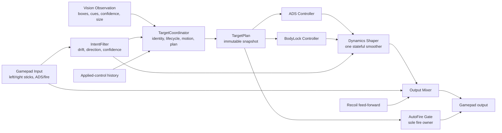

# Target Coordinator Pipeline Rewrite Design

## Status

Proposed Option B design for review. This document defines the target architecture and cutover contract. It does not authorize implementation until reviewed.

## What This System Is and Why It Changes

The native aim pipeline turns vision observations and player gamepad input into ADS snap, BodyLock follow, autofire, and recoil output. Today, target ownership, hold/reacquisition, user intent, braking, and smoothing are distributed across vision selection, tracker/provider, AI aim, controller policies, and output validation.

That distribution creates contradictory state. One layer can report a valid target while another has already released BodyLock; one brake can reduce output before a later policy tries to restore it; deadzone-sized drift can be treated as owner input; and several independent hold timers can disagree about whether an occluded target still exists. The current benchmark baseline demonstrates the outcome: production-style BodyLock chase scenarios record zero BodyLock frames while a focused handoff fixture still enters BodyLock.

Option B replaces the chain once, with one owner of each responsibility. The production switch is atomic: the new pipeline is built and benchmarked beside the legacy path, then replaces it in one cutover. The repository will not keep two permanent behavior stacks.

## Design Goals

1. Preserve normal vision recognition and CUDA/TensorRT throughput; do not add another vision pass, optical flow, or weapon database.
2. Make one component the sole owner of target identity, occlusion hold, motion prediction, and short-horizon plan.
3. Interpret left/right-stick intent once, including adaptive drift filtering, without modifying raw passthrough input.
4. Learn the current ADS response online from observed control/reticle response instead of identifying weapons.
5. Give ADS snap and BodyLock separate control objectives but the same target plan.
6. Apply one stateful dynamics/smoothing stage to AI output, followed by one transparent mixer.
7. Make autofire a single downstream decision using target/fire authority from the plan.
8. Keep the hot path bounded: no new inference, no per-tick heap allocation, and O(1) controller reads.
9. Reduce state count, policy count, duplicated timers, and diagnostic log volume.

## Non-goals

- Reconstructing a literal 3D world model from monocular vision.
- Recording per-weapon ADS movement or sensitivity tables.
- Adding background optical flow, segmentation, or a second detector.
- Solving small-target recognition in this rewrite; size/reliability weighting is supported, but detector quality remains the vision subsystem's responsibility.
- Letting recoil participate in target ownership or user-intent decisions.

## Target Architecture

Vision publishes observations. It does not own the selected target, hold a target, decide BodyLock lifecycle, or latch autofire. `TargetCoordinator` runs when a new vision observation or relevant intent transition arrives and publishes an immutable `TargetPlan`. The 1 kHz controller reads the latest plan in O(1) time.

## Core Contracts

### VisionObservationBatch

Contains only measured evidence:

- frame/source timestamps and frame geometry;
- candidate boxes, aim points, class/cue evidence, confidence;
- normalized target size and a derived observation reliability;
- capture/ROI/fallback metadata needed to judge freshness;
- no active target, pending switch, ownership hold, or fire latch.

Size affects reliability continuously. A small or weak observation reduces plan confidence and allowed AI authority; it does not trigger a separate small-target state machine.

### IntentState

Produced once from the current and recent raw gamepad samples:

- raw left/right vectors preserved separately;
- adaptive neutral bias and noise envelope per axis;
- filtered intent vector, magnitude, direction, and confidence;
- left-strafe phase: neutral, onset, sustained, reversal, release;
- right-stick phase: drift, correction, sustained manual aim, release;
- relationship between left/right intent and planned target motion: aligned, opposing, ambiguous;
- ADS/fire button state and timestamps.

The adaptive neutral estimate updates only inside a conservative neutral envelope. It cannot learn away sustained user input. The filter is used for decisions; the mixer always retains the original raw sticks.

### TargetPlan

The coordinator's immutable output:

- target identity and lifecycle: `none`, `observed`, `coasting`, `reacquiring`;
- observed and predicted aim position;
- velocity/acceleration estimate and coarse motion label: steady, strafe, jump, fall, ambiguous;
- observation age, confidence, size/reliability, and occlusion budget remaining;
- target error and error-rate estimate;
- control mode recommendation: manual, ADS acquire, BodyLock follow;
- ADS demand, BodyLock demand, and maximum safe AI authority;
- response-estimator confidence and learned response scale;
- fire authority and explicit suppression reason;
- short horizon samples sufficient for the controllers; no second planner downstream.

Consumers must not add target lifecycle timers or reinterpret ownership. If a field is insufficient, the contract changes at the coordinator rather than adding another gate.

## TargetCoordinator

`TargetCoordinator` is the sole stateful target owner. It replaces selector ownership, provider selected/owned/candidate states, tracker hold ambiguity, and BodyLock lifecycle gates.

### Association and Ownership

- Associate observations using predicted position, box overlap/scale, cue compatibility, and intent consistency.
- Keep exactly one committed target plus a bounded candidate set for association; candidates never gain control authority until committed.
- Switch only when accumulated evidence exceeds the current target by a margin and a minimum dwell, except when the current target is invalidated.
- Treat a scope-border interruption as missing evidence, not immediate identity loss.
- Release when confidence and hold budget are exhausted or player intent clearly rejects the target.

### Motion and Occlusion

- Use a compact constant-acceleration alpha-beta-gamma style estimator in image-relative coordinates.
- Classify vertical motion from velocity/acceleration sign and persistence, yielding jump/fall labels without a 3D reconstruction.
- During short occlusion, coast the same track and decay authority with uncertainty; do not create a second ownership hold.
- Reacquisition corrects the existing plan smoothly. Innovation is bounded so a reappearing box cannot cause a one-frame position jump.

### Left-stick Relative Motion

Left-stick input is evidence about camera/character-induced relative motion, not a fixed pixel multiplier. The coordinator estimates response online:

1. Detect clean learning windows: stable target identity, adequate observation reliability, no scope transition, no strong right-stick correction, and sufficient left-stick excitation.
2. Compare expected target motion from the target model with observed reticle-relative displacement after known applied control.
3. Update a bounded response coefficient and uncertainty with exponential/RLS-style adaptation.
4. Keep separate short-lived estimates by ADS epoch, not weapon name. Reset confidence on ADS transition or strong inconsistency; retain a conservative warm start in memory for a continuous same-weapon session.
5. Freeze learning during target acceleration, occlusion, ambiguous association, and high innovation.

The learned coefficient affects feed-forward demand only in proportion to confidence. At zero confidence, control falls back to error feedback, so missing learning cannot produce a wrong full-force correction.

## Controllers

### ADS Controller

ADS snap is a point-acquisition controller. It consumes target error, error rate, plan confidence, response estimate, and a bounded time-to-go. It owns one terminal settling behavior. It does not use BodyLock brake rules.

- Strong output is allowed when error is large, evidence is reliable, and the predicted direction is stable.
- Near target, braking derives from predicted stopping error and learned response rather than owner-hold/manual-input booleans.
- Deadzone-sized drift cannot weaken ADS.
- A real right-stick correction reduces or redirects AI authority according to intent confidence.
- Handoff to BodyLock is decided in the plan from acquisition progress and target motion, preventing early mode switches from bypassing ADS settling.

### BodyLock Controller

BodyLock is a trajectory-follow controller. It follows the plan's short horizon and uses feed-forward for target/player relative motion plus bounded feedback for residual error.

- No additional target hold, owner hold, carry brake, or short-plan state downstream.
- It may remain strong near center when motion requires it, but confidence decay and the single dynamics shaper prevent jumps.
- When the plan becomes `coasting`, authority decays continuously with uncertainty instead of dropping to manual in one frame.
- Player correction always remains available through the raw manual mixer.

### Dynamics Shaper

One stateful shaper applies only to the chosen AI command:

- acceleration/jerk limits;
- reversal and innovation shock limits;
- confidence-aware slew rate;
- manual-intent arbitration;
- smooth decay on plan loss.

This replaces independent crossing recovery, carry brake, BodyLock short-plan brake, stateful output validation, and other post-controller corrections. Validation after this stage is stateless finite/range checking only.

### Output Mixer and Recoil

The mixer performs one transparent composition:

`final_right = clamp(raw_manual_right + shaped_ai + recoil_feed_forward)`

It records saturation attribution but does not change lifecycle or target authority. Left stick passes through unchanged. Recoil remains an isolated final feed-forward contribution and cannot affect target selection or ADS/BodyLock mode.

### Autofire

The downstream autofire gate is the sole fire owner. It requires `TargetPlan.fire_authority`, a fresh/stable plan, mode-specific error/velocity bounds, and existing weapon/fire cadence conditions. Vision no longer holds or latches autofire. Every suppressed frame has one enumerated reason.

## State and Module Reduction

The cutover removes or folds these responsibilities rather than layering over them:

| Current responsibility | Option B owner |
| --- | --- |
| Vision active/pending/switch target | `TargetCoordinator` |
| Provider selected/owned/committed/candidate targets | `TargetCoordinator` |
| Selector hold + tracker coast + provider ownership hold | One coordinator lifecycle |
| Repeated manual deadzones/owner-input checks | `IntentFilter` |
| ADS completion/carry/near-target brakes | ADS controller terminal control |
| BodyLock lifecycle and short-plan brake | Coordinator plan + BodyLock controller |
| Dynamics crossing recovery + stateful output validation | One dynamics shaper |
| Vision autofire hold + controller autofire | One downstream autofire gate |

The acceptance target is fewer stateful policy objects and fewer independently configurable timers, not merely fewer source lines.

## Scheduling and Performance Budget

- Vision stays at the configured 80–140 Hz service cadence; no additional inference.
- Coordinator updates at vision cadence plus sparse intent transitions, O(number of candidates).
- The 1 kHz controller path reads an immutable plan and performs fixed-size arithmetic only.
- No heap allocation, filesystem access, logging format work, or mutex contention on the hot controller tick.
- Plan publication uses double-buffered snapshots or an equivalent wait-free single-writer/multi-reader handoff.
- Release benchmark budget: controller additions p95 under `0.05 ms`; no BGRA GPU p95 regression greater than 5%; telemetry drops remain zero in the 1M benchmark.

## Telemetry and Complexity Budget

Normal telemetry is event-driven plus bounded sampling:

- events: target commit/switch/release/reacquire, mode transition, estimator reset/freeze, fire suppression reason change, saturation;
- sampled metrics: plan age/confidence, error/error rate, intent state, learned response/confidence, requested/shaped/final output;
- normal mode samples at a bounded rate (for example 20–50 Hz), full per-tick trace only in an explicit debug session;
- rolling retention and file-size cap remain operational requirements.

Complexity is checked at review time:

- one target lifecycle state machine;
- one intent interpretation;
- one short plan;
- one stateful output shaper;
- one autofire owner;
- no new boolean gate without an enumerated plan/intent state and benchmark evidence.

## Atomic Cutover Strategy

Option B is a one-time production replacement, but implementation remains testable:

1. Freeze the baseline and add missing deterministic fixtures against contracts.
2. Build the new pipeline in a separate namespace/module behind a development-only build switch.
3. Feed identical observations/input traces to legacy and new paths in benchmark builds; compare metrics, not tick-for-tick output.
4. Integrate the new path into the runtime only after contract, behavior, performance, and log-budget gates pass.
5. Switch production wiring once; delete the development switch and obsolete stateful policies in the same cutover series.
6. Re-run all baseline commands with the same seeds and preserve both artifact sets.

No long-lived runtime flag or fallback keeps the duplicate production architecture alive.

## Acceptance Criteria

### Existing Baseline

- All currently passing benchmark tests and harnesses remain passing.
- Gamepad self-test and live-failure existing failures become passing.
- Left-stick `--require-fixed` remains passing.
- AimLab seed `12345` does not regress safety, cooperation, or selection scenario scores.
- BodyLock chase fixtures no longer report zero BodyLock frames; dropout/low-close improve materially without increasing chatter or output spikes.
- ADS occlusion/err-target P95 and 50 px overshoot counts do not regress from the frozen scorecard.
- Adversarial wrong-target, user-fight, invalid-strong, and stale-high frames all improve or remain no worse.
- BGRA, scheduler, telemetry, and GPU-service budgets remain within the stated limits.

### Missing Fixtures to Add Before Tuning

1. Right-stick drift below/around the learned neutral envelope must not weaken ADS.
2. Genuine manual correction must reduce AI conflict without dropping target ownership.
3. Left-strafe onset, reversal, release, same-direction target motion, and opposing target motion.
4. Scope-border occlusion with stable identity and bounded reacquisition innovation.
5. Target ID churn with overlapping candidates and no aim jump.
6. Jump apex and fall transition with smooth vertical output.
7. Online response learning convergence, freeze conditions, ADS reset, and zero-confidence fallback.
8. Small/low-reliability target authority decay without an additional vision pass.
9. Autofire positive case plus every suppression reason.
10. Controller hot-path time, allocation count, log rate, and rolling file cap.

## Main Risks and Mitigations

- **Large behavioral change:** freeze same-seed artifacts and require scenario-level comparison before cutover.
- **Estimator learns target motion as player response:** update only in clean windows and track uncertainty; freeze aggressively under ambiguity.
- **BodyLock becomes smooth but weak:** measure continuity, low-close/dropout, helpful alignment, and sustain, not error alone.
- **ADS becomes strong but overshoots:** use stopping-error terminal control and retain 50 px overshoot gates.
- **Temporary dual-path complexity leaks into production:** development switch has a mandatory deletion task in the atomic cutover.
- **Logs hide state contradictions:** emit one coordinator transition event with previous/new state and reason, rather than unrelated per-layer messages.

## Open Review Decisions

The architecture does not require weapon data or additional vision. Review should confirm only these bounded choices before the implementation plan is written:

1. The new pipeline replaces the legacy stack atomically after benchmark gates; no permanent fallback flag.
2. Online response memory lives only for the current process/continuous ADS context; it is not persisted by weapon identity.
3. Normal telemetry is sampled and capped; full 1 kHz trace is opt-in debug behavior.
