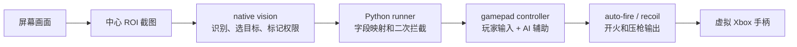
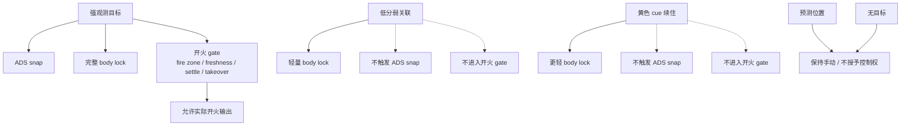

# 从看见目标到可信控制：native vision 和 gamepad 的系统化设计

## 执行摘要

这个应用要解决的是一个实时闭环问题：程序从游戏画面里识别目标，把目标位置转成手柄右摇杆上的细微辅助，再输出到虚拟 Xbox 手柄。它看起来像“识别敌人并辅助瞄准”，但真正的难点不在识别本身，而在识别结果能不能被手柄控制安全、稳定、克制地使用。

在实际 FPS 场景里，目标并不是一直清楚地站在画面中间。开火会产生枪口火光，武器和镜头会遮挡目标，敌人会侧跑或蹲伏，画面会抖，玩家自己的右摇杆也在持续输入。一个只会说“有目标/没目标”的视觉系统不够用；一个只会把准星拉向目标的手柄控制也不够用。

因此，这个项目的核心思路不是把某一个算法做得更重，而是把整条链路分成两件事：

- vision 负责判断“眼前这个目标证据有多强，最多能被信任到什么程度”。
- gamepad 负责判断“在不抢玩家控制权的前提下，这个目标信号应该转成多大的手柄动作”。

最终形成的方向是：强目标可以参与完整辅助链路；弱目标只能短暂续住手感；黄色提示点只能当辅助证据；预测位置不能拿到开火资格。这样可以在减少目标瞬断的同时，避免弱信号被误当成真实目标。

## 一、应用概览

这个应用可以看成四层。

第一层是画面获取和模型识别。系统只截取屏幕中间和准星相关的区域，把这块画面送进 YOLO/TensorRT，得到人形检测框。

第二层是目标判断。模型给出的框只是“可能有人”，还不是“应该瞄谁”。这一层会结合位置、分数、颜色提示、和上一帧目标的关系，选出当前目标，并标记它属于强证据、弱证据、黄色提示续住，还是纯预测。

第三层是手柄控制。系统读取真实手柄输入，在玩家自己的右摇杆动作基础上补一点辅助。远处开镜时需要快速拉近；贴近身体时需要稳住；玩家反向修正时需要让路。

第四层是开火和压枪。自动开火不能只看“有没有目标”，还要看目标来源、目标新鲜度、准星是否稳定、玩家是否正在手动开火。压枪也要和瞄准辅助、玩家输入合在同一帧里输出。

整体链路是：

这个结构的关键不是“分层好看”，而是每一层都有自己的责任：vision 不直接碰手柄，gamepad 不重新选目标，开火不直接相信弱信号。

## 二、核心问题

### 1. 延迟问题：看得见不代表来得及

实时瞄准对延迟非常敏感。画面从屏幕到模型，再到目标选择，再到手柄输出，中间任何一步慢一点，玩家看到的就是准星跟不上。

所以 vision 选择了中心 ROI 和 native 热路径。中心 ROI 是因为 FPS 瞄准主要发生在准星附近，没有必要每帧处理整张屏幕。native 热路径是因为截图、格式转换、模型推理、目标选择都是每帧都要跑的工作，适合放到底层尽量减少搬运和调度开销。

这里的策略不是“所有代码都迁到 C++”。手柄手感调参频繁，留在 Python 更容易迭代和测试。native 只接管最吃延迟、最固定的视觉主链路。

### 2. 目标不稳定：模型框会短暂消失

实际游戏里，目标不是稳定的矩形框。开火时有火光，敌人会被武器遮住，侧身和蹲伏会让框形态变化。模型分数可能突然下降，甚至一两帧完全没有框。

如果一丢框就清目标，手感会断。玩家会感觉准星突然失去吸附，尤其是在已经贴近目标、正在开火的时候很明显。

如果低分框和黄色提示点都完全相信，又会出现更危险的问题：误锁、误切目标，甚至弱信号触发自动开火。

所以 vision 选择的是短续住策略：强目标负责建立和恢复权威，弱证据只允许延续已经确认过的目标。

### 3. 多目标问题：最近的框不一定是该跟的目标

多人靠近、交叉移动、目标从准星附近穿过时，如果只选“离准星最近的框”，目标会左右跳。如果只选“分数最高的框”，又可能被更清楚但不是当前瞄准意图的目标抢走。

因此 selector 不是只看模型分数。它会同时看准星距离、检测分数、框大小、颜色提示、和上一帧目标的连续关系。新目标出生和目标切换也需要短暂确认，避免一帧误识别就改变控制目标。

这也是为什么当前没有优先上完整多目标跟踪。当前应用的输出是单个手柄目标，不是要维护全场所有人的身份。先把“当前应该辅助哪一个目标”做稳定，比上来引入重型跟踪更符合这个阶段。

这里还有一个更贴近实战的细分场景：旧 active 目标突然变成一个很宽、很低的框。它可能是敌人滑铲、趴下或倒地后的活目标，也可能是被击倒后的残留框。如果旁边同时出现一个清晰站立敌人，系统不能简单地继续锁旧框，也不能简单地切到新框。

最新策略做了黄点 double check：如果旧宽低框仍然带有黄色提示点或敌方颜色证据，就优先把它当作滑铲、趴下或低姿态活目标，不切走；如果旧宽低框没有这些敌方证据，而旁边有强站立候选，才允许在确认后逃离旧 active，切到新的站立目标。这个判断补的是“击倒残留”和“低姿态活目标”之间的灰区。

### 4. 手感问题：AI 不能抢玩家的右摇杆

玩家右摇杆不是噪声，而是意图。玩家可能正在顺着目标移动，也可能在主动纠正 AI 的方向。如果 AI 直接覆盖右摇杆，哪怕目标选对了，手感也会变差。

所以 gamepad 的核心不是“把准星拉到目标”，而是“在玩家正在做的动作上补合适的力”。同方向时保留玩家输入，反方向时谨慎抑制，靠近目标时降低抖动，玩家手动开火时自动开火让路。

这条路线把 gamepad 从“输出器”变成了“控制融合器”。

## 三、vision 的策略选择

### 场景 A：画面处理必须快

**问题。** 每帧都处理整屏，成本太高；Python 侧反复搬运画面，也会增加延迟。

**策略。** 使用中心 ROI，只处理准星附近区域；把截图、预处理、推理、目标选择放到 native 侧；Python 只负责调度、配置、结果接收和 controller 逻辑。

**效果。** 视觉主链路更短，性能日志也能拆到更细的阶段，例如等待、预处理、颜色拷贝、推理、后处理、结果年龄、controller 消费年龄。

**边界。** 这不等于 controller 也要马上迁到 C++。手柄控制更多是手感和策略问题，调参和回归测试比极限速度更重要。

### 场景 B：模型检测框不等于可控目标

**问题。** YOLO 输出的是候选框，不是最终目标。候选框可能有多个，也可能有友军、背景误检、边缘框、残缺框。

**策略。** selector 把候选框变成目标。它会综合几个信息：离准星多近、检测分数多高、框大小是否合理、颜色是否像敌方提示、是否延续上一帧目标。

新目标不是一帧就出生，目标切换也不是一帧就完成。这样做是为了防止短暂误识别改变控制方向。

**效果。** 目标选择更稳定，尤其在多人靠近和画面抖动时，不会因为某一帧的分数波动立刻换目标。

**边界。** `target_confidence` 只表示检测框自己的分数，不是整个 selector 的综合可信度。真正的目标判断还包含位置、颜色、连续性等因素。

### 场景 C：开火和遮挡导致目标短暂丢失

**问题。** 开火时目标最需要稳定，但这时视觉反而最容易丢框。枪口火光、武器遮挡、镜头晃动都会让模型分数下降。

**策略。** 引入两种短续住方式。

第一种是低分框弱关联。系统保留较低分数的检测框，但只允许它们在已经有当前目标、并且几何位置贴近当前目标时续住。它不能创建新目标，不能切换目标，不能开火。

第二种是黄色 cue hold。黄色提示点可以帮助判断目标大概还在附近，但它不是人体框，所以只能短暂续住已经确认过的目标。它不能独立创建目标，也不能触发自动开火。

**效果。** 开火和短遮挡时，手感不容易突然断掉。

**边界。** 低分框和黄色 cue 都只是辅助证据。它们能帮助“不断线”，但不能获得完整目标权威。

### 场景 D：弱信号必须被限制权限

**问题。** `has_target=true` 这种表达太粗。强检测框、低分框、黄色提示点、预测位置都可能让系统看起来“有目标”，但它们的可信度完全不同。

**策略。** vision 输出目标时，不只输出位置，还输出目标来源和权限：

- 是否允许辅助瞄准。
- 是否允许进入开火链路。
- 目标是强观测、弱关联、黄色 cue 续住，还是预测。

**效果。** gamepad 不需要猜这个目标该不该用。它可以按权限做不同动作：强目标可以 snap 和完整 body lock；弱目标只能轻量 body lock；cue 更轻；预测目标不进入辅助和开火。

**边界。** 权限必须 fail closed。也就是说，只要来源不清楚、权限缺失、目标过旧，就宁愿不辅助、不自动开火。

### 场景 E：宽低框需要黄点 double check

**问题。** 宽低框很难判断。它可能代表滑铲、趴下、蹲伏后的活敌人，也可能只是击倒后的残留身体。两种情况在几何形状上很像，但控制策略完全不同：活目标应该继续跟，尸体残留应该尽快让出控制权。

**策略。** 当旧 active 目标突然变成明显宽低框时，selector 会看两个证据。第一，旧宽低框自己有没有黄色 cue 或敌方颜色证据；第二，附近是否有一个更清晰、更强的站立候选。如果旧宽低框还有敌方证据，就优先保留旧目标，按滑铲或趴下活目标处理。如果旧宽低框没有敌方证据，而站立候选足够强，才允许从旧锁定中逃逸。

**效果。** 这个判断减少了两类错误：一类是把滑铲活目标误当成尸体切走；另一类是击倒后还粘在旧残留框上，错过旁边新的站立敌人。

**边界。** 这个规则仍然不是完整的身份识别。它只是用黄点和敌方颜色给宽低框多做一次确认，避免把同一种形状粗暴归为“继续锁”或“马上切”。

## 四、gamepad 的策略选择

### 场景 A：刚开镜时需要快速接近目标

**问题。** 玩家按下开镜的前几十毫秒，最需要把准星拉到目标附近。如果这一步慢，后面再稳也来不及。

**策略。** 使用 ADS snap。它只在开镜初期短窗口内工作，只对强目标生效。弱关联和黄色 cue 不能触发 snap。

**效果。** 开镜第一下更快，玩家能更快进入可控范围。

**边界。** snap 时间必须短，目标来源必须强。否则它会像抢玩家镜头，而不是辅助玩家。

### 场景 B：贴近目标后需要稳，而不是继续猛拉

**问题。** 当准星已经贴近目标身体时，继续用强拉动会造成左右摆动。这个阶段玩家更需要的是“稳住身体区域”，尤其是敌人侧跑或自己手抖时。

**策略。** 使用 body lock。它看目标身体框，把辅助点放在更适合稳定的上半身位置，而不是一味追头或追框中心。

对不同来源的目标使用不同力度：强目标力度完整；弱关联降力；黄色 cue 更轻。侧跑时保留一定横向尾力，避免目标刚穿过准星就掉辅助。

**效果。** 近距离跟枪更稳，侧跑目标不容易穿过准星后突然脱锁。

**边界。** body lock 的最大风险是“粘”。当前 live 反馈已经说明这个版本效果很强，后续如果感觉过强，应优先调弱 weak/cue 力度和 body lock 触发范围，而不是扩大视觉信任。

### 场景 C：玩家输入和 AI 输出方向冲突

**问题。** 玩家可能正在用右摇杆修正 AI。如果 AI 仍然强行输出，玩家会感觉控制权被抢。

**策略。** gamepad 做输入仲裁：

- 玩家和 AI 同方向时，保留玩家输入。
- 玩家明显反方向时，根据锁定状态减少 AI 对抗。
- 横向和纵向的小抖动分开处理，避免一个方向的辅助破坏另一个方向的手感。
- 玩家手动开火时，自动开火先释放一小段时间，再决定是否恢复。

**效果。** AI 更像“补力”，不是“接管”。玩家能感觉自己仍然是主控。

**边界。** 输入仲裁没有万能公式。它必须靠 benchmark 和 live 手感一起验证，因为数字稳定不一定代表人感觉自然。

### 场景 D：vision 帧率和 gamepad 循环频率不同

**问题。** vision 不可能每 1ms 给一个新目标，但 gamepad 输出循环很快。如果每次都等最新视觉帧，手柄会断续。

**策略。** gamepad 在短时间内做目标投影。它用上一帧目标位置、目标速度和上一轮右摇杆输出，估算当前误差。

但投影有严格限制：只在很短时间内有效；只有连续强观测才刷新速度；弱关联和 cue 只会让速度衰减；预测位置不能拿到开火权限。

**效果。** 两帧 vision 之间的手感更连贯。

**边界。** 投影只能补手感，不能变成事实来源。任何预测都不能独立触发自动开火。

### 场景 E：自动开火风险最高

**问题。** 辅助瞄准错了，表现是手感不好；自动开火错了，表现就是直接误操作。所以开火链路必须比瞄准链路更保守。

**策略。** 自动开火被拆成多道门：native 先判断目标是否在 fire zone，并给出 fire authority；runner 再做开镜延迟和权限拦截；controller 再检查目标新鲜度；AIAim 再判断准星是否稳定；AutoFire 最后处理玩家手动开火接管。

**效果。** 强目标只是具备开火资格，不代表马上开火。弱关联、黄色 cue、预测目标都不能进入自动开火。

**边界。** native 的 auto-fire request 和 controller 的实际输出必须分开看。前者只是请求，后者才是真正按下手柄键。

## 五、目标权限模型

当前系统可以用一张表理解：

| 目标来源 | 可以辅助瞄准 | 可以 ADS snap | 可以 body lock | 可以自动开火 |
| --- | --- | --- | --- | --- |
| 强观测目标 | 可以 | 可以 | 可以 | 有资格，但还要过多道门 |
| 低分弱关联 | 可以 | 不可以 | 可以，但降力 | 不可以 |
| 黄色 cue 续住 | 可以 | 不可以 | 可以，但更轻 | 不可以 |
| 预测位置 | 不可以 | 不可以 | 不可以 | 不可以 |
| 无目标 | 不可以 | 不可以 | 不可以 | 不可以 |

这张表是整个设计的核心。它把“目标是否存在”拆成了“目标能做什么”。这样 vision 可以把弱证据交出来，gamepad 也不会误把弱证据当成完整目标。

## 六、一条完整场景链路

假设玩家开镜瞄准一个正在移动的敌人。

起初，vision 看到清晰人形框。selector 经过短确认后，把它标成强目标。gamepad 在开镜短窗口内做 ADS snap，把准星拉近。准星贴近身体后，gamepad 切到 body lock，稳定上半身区域。

随后玩家开火。枪口火光和武器遮挡让下一帧检测分数下降。此时如果低分框仍然贴近当前目标，vision 不会直接清目标，而是输出弱关联。gamepad 可以用较轻的 body lock 保持手感，但不会触发 ADS snap，也不会允许自动开火。

如果低分框也消失，但黄色 cue 还在附近，vision 可以用 cue hold 再短暂续住。这个续住同样没有开火权。

等清晰人形框恢复后，目标重新回到强观测状态。即使这时重新具备开火资格，也仍然要经过 fire zone、开镜延迟、目标新鲜度、准星稳定、玩家手动接管等检查。

这条链路体现了当前方案的主判断：宁愿把弱信号当成“手感连续性的材料”，也不把它当成“目标权威”。

## 七、为什么没有优先上更重的跟踪算法

更复杂的算法看起来很有吸引力，比如多目标跟踪、ReID、光流、Kalman 滤波。但当前问题不一定需要先走到那一步。

当前应用不是要理解整场战斗，也不是要长期维护每个敌人的身份。它首先要解决的是：准星附近这个目标，能不能在短遮挡、开火、侧跑时稳定地被辅助，同时不误开火。

在这个前提下，优先级更高的是三件事：

- 目标出生和切换要保守。
- 短遮挡可以续住，但权限要降级。
- gamepad 只能按目标权限做对应动作。

完整多目标跟踪可以解决身份连续性，但会引入更多延迟、更多参数和更多误判来源。ReID 需要外观特征，对实时性和数据质量要求更高。光流和 Kalman 可以改善预测，但也容易让预测位置看起来像事实。

因此，在当前证据下，更合理的路线是先把 detector-led 的短续住和权限模型打稳。等 live 日志证明短续住仍然不够，再考虑引入更重的跟踪方案。

## 八、验证和证据

当前实现已经有几类验证：

| 验证方向 | 主要说明 |
| --- | --- |
| native selector | 覆盖目标出生、切换、颜色判断、黄色 cue、弱关联、开火权限 |
| runner gate | 覆盖 native 结果进入 Python 后是否仍然 fail closed |
| gamepad authority | 覆盖无权限目标是否会被清掉、无开火权目标是否会被挡住 |
| source-aware aim | 覆盖 weak/cue 不触发 ADS snap，body lock 降力 |
| target projection | 覆盖强目标才刷新速度，weak/cue 只衰减速度 |
| auto-fire | 覆盖 freshness、稳定帧、manual takeover 等门 |
| perf logging | 已有分段指标口径，可继续采集延迟和年龄数据 |

gamepad 侧也已有 benchmark 结果，显示高强度 manual-mix 场景下，错误输入恢复帧数和 overshoot 都有明显下降。这说明输入仲裁和手感控制不是只凭感觉在调，已经有一部分量化基础。

但报告需要保持克制：native vision 迁移的前后延迟，本次没有重新采集一组完整对比数据。所以本文只说“已有指标口径”，不编造迁移前后的数字。

## 九、当前主要风险

第一类风险是手感过强。当前 live 反馈已经说明这个版本效果很强，可能略粘。这个问题应该优先通过降低 weak/cue 力度、调整 body lock 范围和目标点来处理，而不是继续放宽 vision 信任。

第二类风险是弱续住误用。低分框和黄色 cue 的价值在于不断线，但它们一旦参与出生、切换或开火，风险会立刻变大。因此后续改动必须继续守住权限边界。

第三类风险是性能和维护。native 侧承担视觉热路径，Python 侧承担控制策略，两边的字段契约要稳定。以后新增字段或改变含义，必须同步补 bridge、runner、controller 测试。

第四类风险是验证覆盖不足。单元测试能证明规则有效，但不能完全证明真实游戏场景中的手感。下一步需要更多 live smoke、录像 replay 和分段日志，尤其要记录目标来源、权限变化、weak/cue 次数、fire request 和最终 fire output 的关系。

## 十、结论

这套应用的关键不是单点算法，而是整条链路的权责划分。

vision 的价值不是简单识别人，而是把视觉证据分级：哪些目标可以建立权威，哪些只能短续住，哪些只能作为提示，哪些只能用于平滑但不能控制。

gamepad 的价值也不是简单拉准星，而是把目标信号、玩家输入、开镜状态、身体框位置、开火风险和压枪输出放到同一个控制模型里。远处要快，近处要稳；强目标可以完整辅助，弱目标只能轻辅助；玩家主动输入时，AI 要让路。

这就是当前路线最通透的一点：系统不追求“永远相信视觉”，而是追求“不同证据只做它该做的事”。只要这个边界守住，后续无论是继续调 body lock，还是增加 replay 日志，还是引入更复杂的跟踪方法，都不会把系统重新拉回“看见一点东西就全权控制”的老问题。
